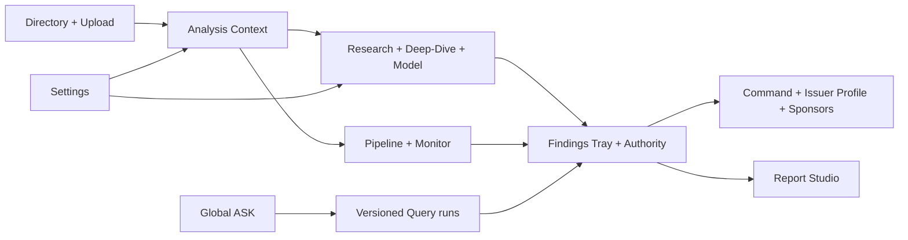

# CAOS Remaining Surfaces — Adversarial Critique and Full Redesign Plan

**Date:** 2026-07-13  
**Scope:** Every user-facing CAOS concept and contextual surface except Query, Sector Review, and RV Screener, which were redesigned in the immediately preceding work.  
**Reviewed:** Issuer Directory, Document Intake, Research, Sponsor Track Records, Command Center, Deep-Dive, Model Builder, Report Studio, Pipeline, Alert Monitor, Settings, Issuer Profile, and global ASK.  
**Primary persona:** buy-side credit analyst. Secondary personas: PM/CIO and Head of Research/QA.  
**Verdict:** **BLOCK** as one coherent decision-grade operating system. Individual surfaces are often useful, but the remaining estate still breaks truth, context, version, persistence, and finalization contracts at the boundaries between them.

## Executive assessment

The new enterprise shell is a meaningful improvement. The remaining risk is not that the product lacks panels, labels, or density. The risk is that mature-looking surfaces still combine different authority levels and state owners:

- live observations, reference fixtures, seeded demonstrations, local drafts, and analyst-ratified conclusions can appear inside the same dominant work region;
- the new analyst-owned `AnalysisContext`, `AuthorityEnvelope`, versioned runs, and Findings Tray stop at the borders of Query, Sector Review, and RV Screener;
- ASK still invokes the legacy capability/graph path rather than the new Query run and findings contracts;
- Model, Report Studio, Research preferences, and Settings retain browser-local state that is not consistently analyst-keyed or server-owned;
- several routes present a visual primary action that does not match the user's real next decision.

The redesign should therefore preserve the visual foundation and rebuild the workflow contracts underneath it. This is not a new design language. It is the existing **Workbench + Evidence Atlas** language applied honestly and completely.

## Adversarial findings

### Critical

1. **Truth-boundary failure across decision surfaces — Saboteur + Security Auditor.** Command, Deep-Dive, Model, Report Studio, Pipeline, and Monitor can render live, reference, demo, local-draft, and modelled content in one work region. Labels exist, but the hierarchy still allows lower-authority content to look decision-ready. Cross-persona corroboration promotes this to critical.
2. **Context/version discontinuity — Saboteur + New Hire.** The three redesigned analytical routes now share canonical contexts and run identifiers; the rest of the application still commonly hands off only an issuer id or route-local state. Two adjacent surfaces can therefore describe different run versions, portfolio scopes, model checkpoints, or published reviews while appearing continuous. Promoted to critical.
3. **Legacy ASK bypasses the new investigation contract — Saboteur + New Hire.** Global ASK still calls capability and graph endpoints directly, keeps route-local answer state, and does not create the persisted Query run/finding/authority chain. It can produce an answer that cannot be recovered, ratified, or compared with the Query workspace. Promoted to critical.
4. **Publication can outrank unresolved authority — Saboteur.** Report Studio's visual output is committee-ready, but its source document and editing state remain partly browser-local and the renderer is not fully issuer-specific. Reference/template output can still be printed, and unresolved claim state is not the sole finalization gate.

### Warnings

1. **Principal-change leakage — Security Auditor.** Explicit logout clears `caos*` storage, but an SSO/profile principal change can be detected without clearing unkeyed Report Studio edits, model preferences, or query-model settings. A different analyst on the same workstation can inherit prior browser-local work.
2. **Route orchestration concentration — New Hire.** Issuer Profile (1,118 lines), Model (840), Deep-Dive (692), Settings (650), and Directory (646) combine fetching, persistence, state transitions, rendering, and workflow policy. A future contributor must modify monoliths to change contracts shared across routes.
3. **Decision-action mismatch — Saboteur.** Command's action points to Monitor rather than the top required portfolio decision; Pipeline's action points to Intake instead of resolving the blocked run; Settings leads with refresh rather than saving the user's work.
4. **Duplicate jobs — New Hire.** Command retains natural-language query, Issuer Profile retains memo intake, and global ASK retains advanced graph/report behavior even though Query, Upload, and Report Studio now own those jobs.
5. **Monitor cadence conflict — Saboteur.** Live autonomy-draft alerts and a seeded end-of-day replay share one visual surface. The provenance language is better than before, but a user must continually reason about which clock and source authority applies.
6. **Role composition is shallow outside the redesigned three — New Hire.** `View: Analyst / PM / QA` is visible, but several remaining surfaces do not materially reorder or simplify information for the selected role. The control can imply personalization without delivering it.

### Notes

- The Impeccable detector found one off-ramp typography literal in Command (`14px` outside the documented type scale). This is not a redesign driver.
- Current desktop live-route checks found no document-level horizontal overflow at the inspected viewport.
- Sponsors is the cleanest truth contract of the remaining work because it is live-only and uses an honest empty state rather than a seeded fallback.

## Surface goal-fit scorecard

Scores measure current ability to fulfil the stated workflow safely, not visual polish.

| Surface | Intended job | Score /10 | Current verdict | Dominant failure |
|---|---|---:|---|---|
| Issuer Directory | Establish coverage, ownership, selection, and batch entry into work | 7 | Concerns | Demo fallback and selection do not yet create a canonical cross-route context |
| Document Intake | Assign issuer/origin/method, ingest sources, and queue an analysis run | 7 | Concerns | Strong wizard, but authority and dependency readiness are not a durable intake manifest |
| Research | Answer a decision-bound external-research brief with recoverable evidence | 6 | Concerns | Durable jobs exist; findings, briefs, and authority do not yet join the shared investigation model |
| Sponsor Track Records | Evaluate sponsor behaviour and issuer read-through | 6 | Concerns | Honest live data, but read-only aggregation lacks event ratification, comparative screens, and sector context |
| Command Center | Give a PM the ten-second portfolio answer and next required action | 5 | Block | Sample sleeve, live coverage, Watchtower draft, governance, and duplicate NL Query compete in one hierarchy |
| Deep-Dive | Build and affirm one defensible issuer credit view | 6 | Block | Rich evidence exists, but reference/live module mixing and a module-first opening dilute the standing decision |
| Model Builder | Edit, stress, version, and defend the issuer model | 7 | Concerns | Best-in-class instrument shape, but local inputs and draft forecasts lack one immutable model-run contract |
| Report Studio | Compose and export a claim-linked committee document | 5 | Block | Excellent paper counterpoint; browser-local edits and partial renderer wiring undermine publication authority |
| Pipeline | Inspect execution, clearance, failures, and recovery for one run | 6 | Concerns | Honest run states, but live/demo modes and incomplete driver lineage prevent a single operational truth |
| Alert Monitor | Triage events through impact, owner, action, and resolution | 5 | Block | Live alert draft and seeded replay share a surface and governance is duplicated from Command |
| Settings | Manage analyst preferences and inspect workspace policy safely | 6 | Concerns | Local, analyst-server, and environment-owned settings share one form without a single save/audit contract |
| Issuer Profile | Provide persistent issuer context without replacing the active workflow | 7 | Concerns | Strong read model, but monolithic route, duplicate memo intake, and incomplete context/version handoff |
| Global ASK | Ask a quick contextual question from any surface | 4 | Block | Legacy client path duplicates the redesigned Query system and loses persisted investigation semantics |

**Collective score:** **6.0/10**. The product is visually coherent but not yet contractually coherent.

## Shared target contract

Every remaining surface adopts these rules before route-specific redesign:

1. **One context:** extend `AnalysisContext` to carry issuer, instrument, portfolio, source manifest, active issuer run, model checkpoint, report version, alert, sponsor, and pipeline-run references as applicable.
2. **One authority envelope:** every conclusion, metric group, alert, sponsor event, model checkpoint, and report claim exposes origin, method, as-of, freshness, source ids, version ids, confidence, approval, and analyst override.
3. **One version rule:** mutable work is a draft; finalization creates an immutable version. New work never rewrites a prior published review, model checkpoint, report PDF, or committee decision.
4. **One findings path:** Research claims, Deep-Dive conclusions, Model overrides, Sponsor events, Monitor alerts, and ASK answers pin through the same analyst-owned Findings Tray.
5. **One persistence rule:** sensitive or decision-bearing state is server-owned and analyst-scoped. Browser storage is an optional presentation cache only and is cleared/re-keyed when the active principal changes.
6. **One page-level primary action:** the action follows the current state. If the object is blocked, recovery replaces finalization. Low-frequency simulation, layout, export, and display controls stay in utilities.
7. **One evidence behavior:** selected work controls the Evidence Atlas. No route mounts a second provenance or citation system beside it.
8. **One responsive contract:** desktop supports full work; tablet prioritizes the dominant region and turns evidence into a drawer; phone supports reading, filtering, acknowledgment, assignment, and handoff only.

## Proposed surface redesigns

### 1. Issuer Directory

- **Layout:** saved coverage views left; virtualized issuer worklist center; selected issuer preview/evidence right; sticky batch/finalization bar.
- **Primary action:** `Add issuer`. Batch actions appear only after selection.
- **Add:** ownership SLA, source health, last published review/run, portfolio membership, stale/unowned saved screens, server-persisted filters and selection.
- **Remove:** using demo rows inside the real coverage table. Put the reference universe in an explicit reference workspace.
- **Dependencies:** issuer registry, profile read model, portfolio membership, run registry, source manifests, analysis context.

### 2. Document Intake

- **Layout:** dominant staged-document lane; preflight and ingestion readiness inspector; no separate generic wizard page chrome.
- **Primary action:** `Ingest documents`, enabled only when issuer, origin, method, MNPI handling, and extraction strategy are explicit.
- **Add:** immutable intake manifest, duplicate detection, OCR/extractor choice, source replacement/versioning, pricing-snapshot recognition, run impact preview, partial retry per file.
- **Remove:** silent empty-vault outcomes and source metadata that exists only in form state.
- **Dependencies:** Upload APIs, antivirus, OCR/MarkItDown, vault, source register, pricing adapter, Pipeline run creation.

### 3. Research

- **Layout:** decision brief left; working report center; claim/source ledger right; finalization bar for pinning findings or handing off.
- **Primary action:** `Run research` or `Resume run`, state-dependent.
- **Add:** saved/server-owned briefs, version comparison, explicit lane/model/cost preview, claim extraction, contradiction log, source-quality scoring, cancel/detach/resume, pin to Findings Tray.
- **Remove:** treating a completed generated report as an approved conclusion.
- **Dependencies:** durable research jobs, analyst settings, Query/Findings, source register, Report Studio.

### 4. Sponsor Track Records

- **Layout:** saved screens left; comparative sponsor ledger center; selected sponsor dossier and underlying events right.
- **Primary action:** `Review selected sponsor`.
- **Add:** normalized sponsor aliases, event taxonomy, evidence-backed event ledger, issuer outcome tracking, compare 2–5 sponsors, sector/portfolio read-through, analyst ratification, monitoring thresholds.
- **Remove:** aggregate scores that cannot be traced to an event and source.
- **Dependencies:** issuer registry, document extraction, sector taxonomy, profile facts, portfolio, Monitor, Findings.

### 5. Command Center

- **Layout:** decision header; dominant ranked-change list; compact posture and governance inspector; coverage table below or on demand.
- **Primary action:** `Review top change`, never a generic link to Monitor.
- **Add:** severity × position-size ranking, ratified-only default, per-row owner/action/deadline, portfolio impact, cross-route context handoff, explicit draft queue for QA.
- **Remove:** the embedded NL Query, sample sleeve beside live coverage, and any seeded stat in the decision hierarchy.
- **Dependencies:** published sector/RV/issuer findings, portfolio, Monitor, QA, AnalysisContext, Findings.

### 6. Deep-Dive

- **Layout:** conclusion-first standing view center; searchable pinned/recent module rail left; claim-level Evidence Atlas right; finalization bar.
- **Primary action:** `Affirm view`, `Revise`, or `Resolve blocker` depending on state.
- **Add:** versioned thesis, change comparison, module dependency map, uncertainty register, section-level ratification, downstream-consumer map, exact run/model/sector context.
- **Remove:** a 19-module wall as the opening state and reference fixture content inside a live issuer workspace.
- **Dependencies:** live issuer run, model checkpoint, published sector review, sources, Findings, Report Studio, Monitor.

### 7. Model Builder

- **Layout:** retain full-screen spreadsheet; formula/authority bar above; scenario and evidence inspector right; compact checksum/finalization bar below.
- **Primary action:** `Save & re-run` when inputs changed; `Publish checkpoint` only after successful computation and checks.
- **Add:** immutable checkpoints, model-run jobs, cell provenance, reported/base/override toggle, formula diff, stale-dependency invalidation, multi-cell paste audit, named scenarios, tie-outs, conflict-safe collaborative ownership.
- **Remove:** authoritative dependence on unkeyed localStorage and any seeded fallback inside a live issuer workbook.
- **Dependencies:** CP-1 facts, saved model API, analysis jobs, evidence sources, Deep-Dive thesis, Report Studio.

### 8. Report Studio

- **Layout:** outline left; light paper preview center; claim lineage and export preflight right; sticky finalization.
- **Primary action:** `Export committee PDF` only when the document hash, source authority, QA state, and ratification gates pass. Otherwise the primary becomes `Resolve claims`.
- **Add:** server-owned document versions, claim-level evidence sync, immutable export manifests/hashes, version compare, approval history, section ownership, print validation.
- **Remove:** browser-local report edits as the source of truth and printable reference/demo pages without an unavoidable watermark and export restriction.
- **Dependencies:** published findings, model checkpoint, Deep-Dive thesis, QA, committee decision snapshot, evidence store.

### 9. Pipeline

- **Layout:** run selector/worklist; dominant DAG or lanes; selected step recovery inspector; event log in a drawer.
- **Primary action:** state-dependent `Resolve blocked step`, `Resume run`, or `Open latest run`.
- **Add:** immutable run manifest, dependency-aware retry, cancel/restart policy, owner and ETA, prior-good artifact preservation, exact downstream consumers, live event stream, driver lineage.
- **Remove:** live/demo toggles inside one operational run and Intake as the universal page-level action.
- **Dependencies:** source manifest, engine registry, job events, QA gates, findings, Report Studio, Monitor.

### 10. Alert Monitor

- **Layout:** impact-ranked inbox center; selected alert evidence/action inspector right; sticky triage action; phone collapses to the same queue contract.
- **Primary action:** `Acknowledge top alert` or `Assign top alert` when unowned.
- **Add:** durable alert lifecycle, deduplication, escalation SLA, monitoring thresholds, analyst ownership, evidence confidence, related finding/context, resolution reason, audit trail.
- **Remove:** seeded replay inside the live inbox. Keep a separate reference/demo mode outside the production queue.
- **Dependencies:** autonomy draft/event adapters, email intelligence, portfolio, sector/issuer findings, QA, Command.

### 11. Settings

- **Layout:** categories left; editable setting group center; effect/audit inspector right; one sticky save bar.
- **Primary action:** `Save changes`; environment-owned settings remain read-only and have no fake save affordance.
- **Add:** explicit storage scope, effective timing, permission source, impact preview, server-owned analyst preferences, audit history, reset/revert, unsaved-navigation guard.
- **Remove:** invisible split between localStorage, analyst JSON, and environment variables.
- **Dependencies:** analyst settings API, workspace settings, authorization policy, audit events.

### 12. Issuer Profile

- **Layout:** contextual overlay/drawer; sticky section rail left; ten-second answer and trends center; evidence/downstream consumers right.
- **Primary action:** `Open Deep-Dive` for analysis, while Upload remains a secondary context-preserving handoff.
- **Add:** canonical active context, current/published/draft separation, thesis timeline, run/model/report versions, source health, exact portfolio/instrument links, follow-selection behavior.
- **Remove:** memo upload and analysis authoring inside the profile read model.
- **Dependencies:** issuer profile API, AnalysisContext, published artifacts, portfolio, Monitor, Findings.

### 13. Global ASK

- **Layout:** compact overlay on the current page; visible scope chips; one composer; concise grounded answer; claim/citation rail; explicit `Open in Query` handoff.
- **Primary action:** `Run question`.
- **Add:** shared Query run API, context preservation, authority envelope, pin finding, recent questions, deterministic-lane disclosure, recovery when advanced lanes are unavailable.
- **Remove:** graph authoring, report composition, and independent history from the overlay. Query owns complex and persisted investigations.
- **Dependencies:** redesigned Query runs, AnalysisContext, Findings, citation viewer, route-specific scope resolver.

## Dependency architecture

## Delivery sequence

1. **Safety baseline** — freeze current fixtures/screenshots, add decision-safety tests, and reject any reference/demo object from live publication or actionable ranking.
2. **Cross-surface foundation** — extend context/authority/finding contracts; add model/report/sponsor/alert/run identifiers; implement principal-change storage clearing and analyst-scoped server persistence.
3. **Intake and identity** — migrate Directory, Upload, Issuer Profile, and Sponsors. Establish the source manifest and contextual handoff spine first.
4. **Analyst instruments** — migrate Research, Deep-Dive, and Model. Preserve spreadsheet and evidence-sync behavior while making versions and ratification explicit.
5. **Operations and PM** — migrate Pipeline, Monitor, and Command. Remove demo/live mixing and make recovery/required action the primary hierarchy.
6. **Publishing and policy** — migrate Report Studio and Settings. Make export and preference changes immutable/auditable.
7. **Global verb** — rebuild ASK as a thin client of the new Query contract; remove Command NL Query and route-local graph/report behavior.
8. **Retirement** — remove legacy route state, unkeyed decision-bearing localStorage, reference fallbacks inside live routes, and duplicated evidence/query/intake implementations.

## Release gates

- No demo/reference/seed object can satisfy a live action, publication, ratification, or portfolio-ranking gate.
- Every handoff preserves the canonical context, selected object, filters, version ids, and authority.
- Every finalized artifact is immutable; refresh/re-run creates a draft and preserves the prior good version.
- Principal changes clear or re-key all browser caches before the new user sees a surface.
- Exactly one page-level primary action is visible; it changes to recovery when the workflow is blocked.
- Model remains keyboard-operable as a spreadsheet; Report Studio remains a light print surface; phone remains triage-only.
- Desktop, laptop, tablet, phone, and 200% zoom pass without document overflow or hidden focus.
- Zero serious or critical axe violations, no keyboard traps, and no status conveyed by color alone.
- End-to-end journey passes: Directory → Upload → Pipeline → Deep-Dive → Model → Research/ASK → Finding → Command → Report Studio → Monitor.

## Visual studies

The examples are spatial contracts, not literal production implementation. They preserve the current CAOS palette, type, panel anatomy, density, and light Report Studio paper counterpoint.

Source board: `caos/frontend/outputs/adversarial-all-surfaces-redesign/index.html`

Rendered screens:

1. `01-issuer-directory.png`
2. `02-document-intake.png`
3. `03-research.png`
4. `04-sponsor-track-records.png`
5. `05-command-center.png`
6. `06-deep-dive.png`
7. `07-model-builder.png`
8. `08-report-studio.png`
9. `09-pipeline.png`
10. `10-alert-monitor.png`
11. `11-settings.png`
12. `12-issuer-profile.png`
13. `13-global-ask.png`
