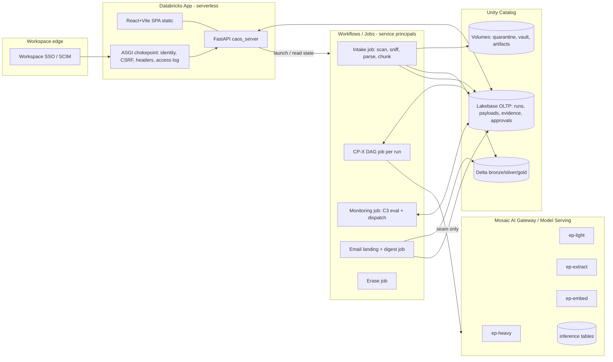
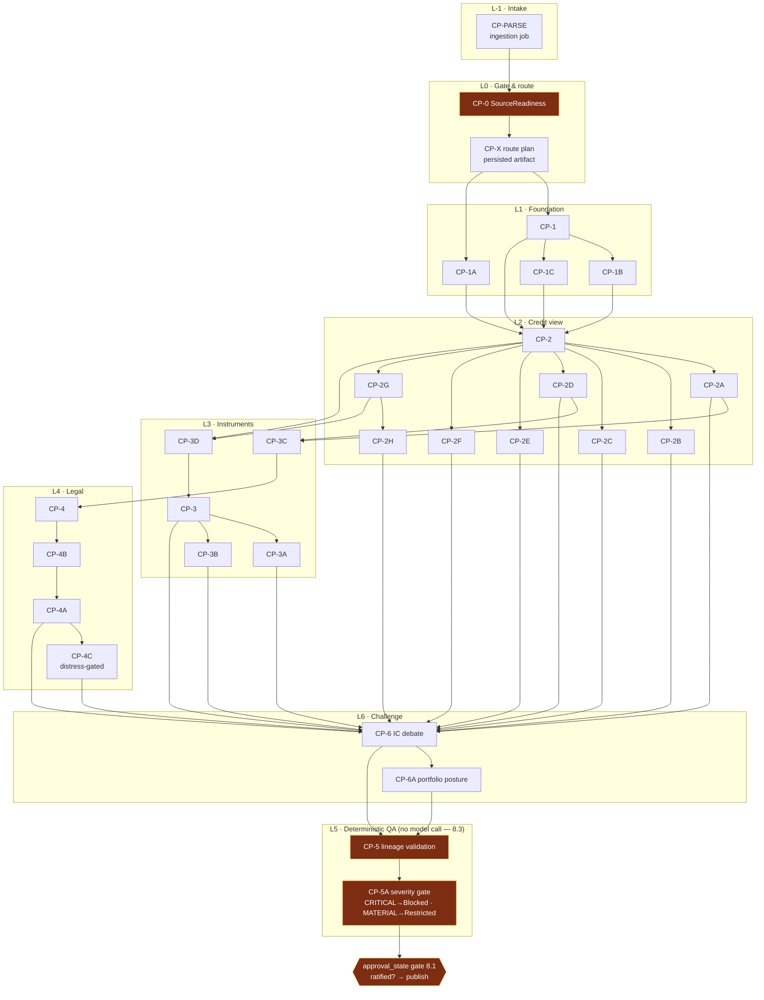

# ARCHITECTURE.md — CAOS on Databricks (Greenfield Rebuild)

Target platform is **fixed**: Databricks Data Intelligence Platform, Unity-Catalog-native
from day one. Every component maps to a checklist-named primitive; any divergence is a
`DEVIATIONS.md` row. Legacy engine behaviour is the golden master (9.1); the corpus
`corpus/DEPLOY_B_COWORK_SKILLS/` is normative for engine contracts.

Companion documents: `audit/AUDIT-2026-07-28.md` (why), `architecture/DECISIONS.md`
(what ports), `roadmap/ROADMAP.md` (when), `specs/phase-01-foundation.md` (how, first).

---

## 1. Core design principles

1. **Pure deterministic core, separable from serving (8.3, 9.2).** `caos_engine` and
   `caos_contracts` are pure Python packages: no I/O, no SQLAlchemy, no HTTP, no
   `databricks-*` imports, no clock/randomness in computation paths. Property tests and
   the CP-5A gate run in plain CI with **no cluster and no network**. An import-layering
   test enforces this structurally (not by convention).
2. **Fail closed, everywhere, by type.** Closed enums for every status vocabulary;
   unknown → most restrictive (the `_QA_RANK.get(s, 99)` pattern). Environment posture
   is one validated config object computed at boot (audit F-6). Boot refuses unsafe
   config (6.5).
3. **Schema is the contract (8.5).** Constraints (FK, CHECK, UNIQUE) live in DDL, not
   ORM metadata. The evidence chain is unfalsifiable by construction: a `MetricFact`
   cannot exist without its chunk/claim/evidence keys.
4. **One namespace.** Module IDs are the DEPLOY_B canonical namespace everywhere; the
   legacy alias map (keyed by legacy ID + `owned_object`) exists **only** inside the
   parity harness.
5. **Platform state only (audit F-8).** No in-process lock, cache, or counter guards a
   cross-request invariant. Idempotency, single-active-run, rate counters, run leases —
   all DB- or platform-enforced.
6. **Canon rules are invariants** (corpus `_COMMON_CORE.md` 1–9): fail-closed
   validation, stop-on-Blocked, Upstream Re-Anchor Gate, limitation-flag propagation,
   null≠zero, never fabricate, covenant capacity never inferred, a model never grades
   its own output.
7. **Every number ≤2 interactions from source** (8.5) — in data (FK hops) and in UI
   (EvChip → Evidence Sync → source chunk).

## 2. Platform mapping (checklist → primitive)

| Concern | Legacy | Databricks primitive | Checklist |
|---|---|---|---|
| Hosting | 8-service Docker stack | **Databricks App** (serverless; FastAPI + static React/Vite) | 6.1 |
| Identity | Caddy → oauth2-proxy (Google) | **Workspace SSO** (enterprise IdP + SCIM); app-side chokepoint kept as defence-in-depth | 2.1, 2.5 |
| AuthZ | role CHECK + tenancy module | **UC grants + ABAC** + app role map from workspace groups | 2.2 |
| Model calls | direct Anthropic/OpenRouter/Gemini keys | **Mosaic AI Model Serving / AI Gateway** external-model endpoints through the ported seam | 3.1, 3.2 |
| Prompt logging | `LLMCallRecord` only | AI Gateway **inference tables** + ported `LLMCallRecord` | 3.4 |
| OLTP state | self-hosted Postgres | **Lakebase** (managed Postgres, UC-registered) | 6.2 |
| Vectors | self-hosted pgvector | **Lakebase pgvector** (Vector Search deferred — D-DBX-001) | 6.2 |
| Documents/artifacts | container FS vault | **UC Volumes** (quarantine → vault → artifacts) | 7.1, 6.4 |
| Analytics/landed data | (none) | **Delta medallion** bronze/silver/gold + UC lineage | 4.4, 8.2 |
| Background execution | 4 executors + pollers | **Workflows / Jobs (Lakeflow)** — CP-X DAG, intake, email landing, monitoring, erase | 6.3 |
| System identity | app process | **Service principals** for jobs + app compute | 2.3 |
| IaC | docker-compose | **Asset Bundles (DABs) + Terraform** | 5.5 |
| CI/CD | GH Actions (partial) | Bundle CI: SCA, SAST, contract drift, a11y, parity | 5.2, 5.3, 5.6, 9.3, 9.1 |
| Backups | rclone off-host | Lakebase managed backups + Delta; scheduled restore drill | 4.3, 6.6 |

## 3. Repository structure

The rebuild lives in this repository under `dbx/` so the parity harness can import the
legacy engine in-process (`caos/` becomes read-only reference; OPEN-QUESTIONS Q-002
covers the enterprise-org migration of the whole repo, 5.1).

```
dbx/
  databricks.yml            # Asset Bundle root: app, jobs, endpoints, targets
  pyproject.toml            # uv-managed; src layout; pinned lockfile (uv.lock)
  config/
    environments.md         # placeholder registry: {{WORKSPACE_HOST}}, {{CATALOG}}, groups
    tiers.yml               # tier→endpoint map (heavy/light/extract × cheap/fast/strong/top)
  src/
    caos_contracts/         # PURE: enums, envelope, payloads, filename rule, validator port
    caos_engine/            # PURE: guards, periods, registry, modules, gate, lineage, planner
    caos_gateway/           # seam: GatewayClient → serving endpoints; fixture client
    caos_orchestration/     # task wrappers, pathway defs, stop-on-Blocked, re-anchor
    caos_server/            # FastAPI Databricks App (identity, routes, static mount)
  frontend/                 # Vite + React SPA (ports the design system + surfaces)
  schemas/
    lakebase/               # 0001_*.sql … forward-only DDL migrations (source of truth)
    delta/                  # bronze/silver/gold table DDL + volume definitions
  jobs/                     # job entrypoint scripts referenced by databricks.yml
  parity/
    corpus/                 # frozen fixture corpus + MANIFEST.sha256 (never edited)
    alias_map.py            # legacy↔canonical module map (owned_object-keyed)
    harness/                # runs legacy engine (from caos/) vs dbx engine; field diff
  tools/
    validate_handoff.py     # vendored verbatim from corpus (reference implementation)
    conformance/            # golden envelope files exercising every validator branch
  tests/
    contracts/  engine/  gateway/  orchestration/  parity/   # CI-pure
    platform/                                                # needs a workspace; tagged
  infra/                    # terraform: catalog, schemas, volumes, grants, SPNs
```

Dependency direction (enforced by `tests/contracts/test_import_layering.py`):

```
caos_contracts  ← caos_engine  ← caos_orchestration ← jobs
      ↑               ↑         ← caos_server        ← frontend (via OpenAPI)
      └── caos_gateway┘
caos_contracts: stdlib + pydantic only.  caos_engine: stdlib + caos_contracts only.
```

## 4. Component architecture



- **The App never computes analytics and never calls models directly**: it reads/writes
  Lakebase, serves the SPA, launches jobs, and enforces identity/approval gates. All
  model traffic originates in jobs (or tightly-scoped App query lanes) and passes
  through `caos_gateway` — nothing else may import an HTTP client for model calls
  (grep-gate in CI, 3.1).
- **Jobs run as service principals** (2.3) with UC grants scoped per lane; the App runs
  with its own SP + on-behalf-of-user authorization for user-scoped reads.
- **App auth**: workspace SSO yields the verified user identity headers; the ported
  chokepoint validates platform auth context, maps workspace groups →
  `analyst/viewer/qa/admin`, and keeps HMAC-session/`token_version` machinery as the
  second factor for state-changing routes (2.4/2.5).

## 5. Data model

Authoritative DDL lives in `dbx/schemas/`; Phase 1 ships the initial migration
(`specs/phase-01-foundation.md` §DDL contains it in full). Summary of the design:

### 5.1 Lakebase OLTP (schema `caos`)

Core entity groups (ported from the audited legacy schema, canonical IDs, constraints
in DDL):

| Group | Tables | Key constraints carried / added |
|---|---|---|
| Identity | `analysts`, `teams` | `ck_analysts_role IN ('analyst','viewer','qa','admin')`; `token_version` epoch |
| Corpus | `issuers`, `documents`, `document_chunks`, `document_chunk_embeddings` | scope-unique issuer names; chunk `tsv` GIN; embeddings `(model, chunk_hash)` unique + HNSW cosine; **`provenance` on embeddings** (mock-vector lesson) |
| Runs | `runs`, `module_outputs`, `claims`, `evidence_items`, `qa_findings`, `metric_facts` | partial-unique active run per issuer; `uq_run_module(run_id, module_id)`; **evidence-chain FKs (8.5)**; `uq_fact(issuer_id, run_id, metric_key, period)`; `runs.input_corpus_sha256` + snapshot fields (6.4); `runs.model_id`/`prompt_version`/`model_mode` (3.7); `runs.halt_reason` (stop-on-Blocked) |
| Artifacts | `artifact_envelopes` (canonical Markdown envelope index: subject_key, module_id, run_id, analysis_date, filename, sha256, volume_path, `qa_status`, `limitation_flags`), `report_drafts`, `report_versions`, `model_checkpoints`, `model_drafts_v2`, `model_override_events`, `model_workbook_imports` | `report_versions.document_sha256` NOT NULL + verify-on-read; envelope filename **generated and CHECK-validated** against `subject_key || '_' || module_id || '_' || to_char(analysis_date,'YYYYMMDD') || '.md'` |
| Approvals | `source_manifests` (`approval_state ∈ draft/ratified/published/rejected`), `decisions`, `decision_votes`, `committee_*`, `thesis_versions` | ratification gates (8.1): run creation and publish check `ready + ratified/published + malware_clean` |
| Audit | `llm_call_records`, `lineage_edges`, `pipeline_runs`, `read_audit` (new, sensitive domains — Q-011) | `lineage_edges.v2_idempotency_key` unique; `llm_call_records.prompt_hash` |
| Monitoring | `watch_rules` (+versions/evaluations), `alert_events`, `alert_states`, `alert_delivery_intents`, `notification_events`, `sector_signals` | full C3 CHECK discipline incl. **`news` kill-switch** (8.4); alert-state lattice; idempotency keys |
| Market/portfolio | `market_snapshots`, `market_instruments`, `portfolios`, `portfolio_positions`, `portfolio_constraints` | ported as-is |

Status vocabularies are DDL CHECKs mirroring `caos_contracts` enums:
`qa_status ∈ ('Not Reviewed','Passed','Restricted','Blocked')`,
`committee_status ∈ ('Blocked','Restricted','Draft Only','Insufficient Information','Committee Ready')`,
severity ∈ `('CRITICAL','MATERIAL','MINOR')`.

### 5.2 Delta medallion (`{{CATALOG}}`)

| Layer | Schema | Tables (initial) | Purpose |
|---|---|---|---|
| Bronze | `bronze` | `landed_mail`, `landed_vendor_docs`, `edgar_raw_facts` | Approved external data landed by governed jobs (4.4); append-only; UC lineage roots |
| Silver | `silver` | `doc_chunks` (mirror of OLTP chunks for analytics), `mail_messages_clean`, `credit_signals`, `market_history` | Cleaned/typed; ABAC-masked columns for PII (4.5) |
| Gold | `gold` | `module_payloads` (one row per `module_outputs`, exploded key metrics), `metric_facts`, `coverage_health`, `run_ledger` | Committee/monitoring marts; **re-derived, never migrated** (9.5) — regeneration from the frozen corpus *is* the parity test |

Volumes: `{{CATALOG}}.ingest.quarantine` (pre-scan uploads), `{{CATALOG}}.ingest.vault`
(clean originals; content-addressed `sha256/` paths), `{{CATALOG}}.artifacts.reports`
(rendered XLSX/PDF/MD envelopes; immutable names).

### 5.3 Typed payloads

`module_outputs.runtime_output` remains JSON in storage but is **typed at every
boundary** by `caos_contracts` models generated from the corpus payload schemas
(`CP_MODULE_PAYLOAD_BASE.schema.txt`, per-module `CP-XX__*__payload.schema.txt`,
`CP_WORKBOOK_EXPORT_PAYLOAD_BASE.schema.txt`). A JSON-Schema conformance test pins the
pydantic models to the corpus files byte-for-byte semantics (Phase 1).

## 6. Orchestration — the CP-X DAG on Workflows

### 6.1 Normative graph

The DEPLOY_B route graph v2.6 is the DAG (verbatim,
`corpus/.../rbot-orchestrator/references/ROUTE_GRAPH.md`); the typed registry in
`caos_engine/registry.py` encodes it with the legacy two-edge-kind design
(`depends_on` hard input gate vs `after` soft ordering — audit-proven):

```
CP-PARSE->CP-0  CP-0->CP-X  CP-X->CP-1,CP-1A
CP-1->CP-1B,CP-1C,CP-2,CP-2A,CP-2D,CP-2G,CP-2H,CP-3,CP-3C,CP-3D,CP-4,CP-4A,CP-6
CP-1A->CP-2,CP-2C   CP-1B->CP-2,CP-2A   CP-1C->CP-2,CP-3,CP-6
CP-2->CP-2A,CP-2B,CP-2C,CP-2D,CP-2E,CP-2F,CP-2G,CP-2H,CP-3,CP-3D,CP-6
CP-2A->CP-2G,CP-4C,CP-3C,CP-6,CP-6A   CP-2B->CP-6   CP-2C->CP-6
CP-2D->CP-2G,CP-3,CP-3C,CP-4C,CP-6    CP-2E->CP-2G,CP-6   CP-2F->CP-6
CP-2G->CP-2H,CP-3,CP-3C,CP-3D,CP-4C,CP-6
CP-2H->CP-2B,CP-3,CP-3C,CP-3D,CP-6
CP-3->CP-3A,CP-3B,CP-6,CP-6A   CP-3A->CP-6   CP-3B->CP-6,CP-6A
CP-3C->CP-4,CP-4C,CP-6         CP-3D->CP-3,CP-3A,CP-3B,CP-4C,CP-6
CP-4->CP-4A,CP-4B,CP-4C,CP-6   CP-4B->CP-4A,CP-4C,CP-6
CP-4A->CP-4C,CP-6,CP-6A        CP-4C->CP-6,CP-6A
CP-5->CP-5A   CP-6->CP-6A,CP-5   CP-6A->CP-5
ALL ANALYTICAL->CP-5,CP-5A (implicit)   VALIDATED DECISIONS->CP-8 (optional)
CP-DR, CP-EMAIL: standalone (no dependency edges; manual advisory follow-ups only)
```

### 6.2 Diagram — Pathway 1 (Full Credit Assessment) with first-class QA states



**Every module task runs the same wrapper protocol** (`caos_orchestration.task`):

1. **Halt check** — read `runs.halt_reason`; non-NULL ⇒ record `skipped_blocked` and
   exit. This is what makes stop-on-Blocked span *independent branches*, per the
   corpus rule ("does not route around a blocked gate even if a downstream node's
   other dependencies are satisfied").
2. **Upstream Re-Anchor Gate** — for each `depends_on` upstream: load its persisted
   envelope/payload and verify `module_id`, `run_id`, `reporting_period`, subject
   identity match the plan. Missing/mismatched/Blocked upstream ⇒ this module persists
   a structural `Blocked` output with the input-gate reason (no inference, canon 4).
3. **Limitation propagation** — the union of upstream `limitation_flags` is passed
   into the module context and re-emitted on its output (flags prefixed with origin
   module, deduplicated), so every downstream consumer carries them (corpus §5.5).
4. **Execute** — call the pure engine (`caos_engine.run_module`) with typed inputs;
   LLM lanes go through `caos_gateway` under the run budget.
5. **Persist** — payload + envelope row + claims/evidence + metric-fact projection
   (projection refuses Blocked outputs — legacy `stop-on-Blocked` fact rule).
6. **Gate** — after synthesis layers, CP-5 → CP-5A run as **pure deterministic tasks**
   (8.3): findings in, `qa_status`/`committee_status` out. If any module lands
   `Blocked`, the wrapper sets `runs.halt_reason` and **raises**, failing the task so
   Workflows halts dependents; a terminal `finalize` task (`run_if: ALL_DONE`)
   computes the honest roll-up, CP-5D blocked-upstream cascade, and closes the run.

**Pathways.** The eight corpus pathways are declarative subsets of the DAG
(`caos_orchestration/pathways.py`), selected by CP-X; a pathway maps to one
parameterized Workflows job run (`pathway`, `run_id`, `issuer_id`). CP-DR and
CP-EMAIL are separate standalone jobs (no edges). Monitoring (C3) and email landing
are scheduled jobs (6.3) reusing the same wrapper discipline.

**Committee Assurance Mode** maps to platform gates rather than chat ritual: every
node artifact is validated by the ported `validate_handoff` logic at persist time
(fail-closed); decision-grade publication additionally requires `approval_state =
ratified` by a human (8.1) — the analog of the operator `PASS`.

## 7. Boundary contracts (typed interfaces)

### 7.1 Canonical envelope (`caos_contracts.envelope`)

```python
class QaStatus(StrEnum):        # closed; unknown input -> ValidationError
    NOT_REVIEWED = "Not Reviewed"; PASSED = "Passed"
    RESTRICTED = "Restricted";    BLOCKED = "Blocked"

class ConfidenceBand(StrEnum):
    HIGH = "High"; MEDIUM = "Medium"; LOW = "Low"
    INSUFFICIENT = "Insufficient Information"

class CommitteeStatus(StrEnum):
    COMMITTEE_READY = "Committee Ready"; DRAFT_ONLY = "Draft Only"
    REQUIRES_MORE_WORK = "Requires More Work"
    INSUFFICIENT = "Insufficient Information"
    RESTRICTED = "Restricted"; BLOCKED = "Blocked"

class UpstreamArtifactRef(BaseModel):
    module_id: ModuleId; run_id: str; period: str

class CanonicalEnvelope(BaseModel):
    """The 15-field YAML frontmatter contract (validate_handoff.py REQUIRED_FIELDS
    + issuer profile), plus the CP-DR profile variant."""
    module_id: ModuleId
    module_name: str
    run_id: str
    issuer_name: str | None          # issuer profile (None only for CP-DR)
    issuer_id: str | None
    reporting_period: str
    analysis_date: date
    confidence_score: int            # 0..100
    confidence_band: ConfidenceBand  # must equal band_for(confidence_score)
    qa_status: QaStatus
    committee_status: CommitteeStatus
    limitation_flags: list[str]
    validation_warnings: list[str]
    upstream_artifacts_used: list[UpstreamArtifactRef]
    downstream_consumers: list[ModuleId]
    cp_dr: CpDrProfile | None        # scope_type/scope_key/plan_hash/coverage/… when CP-DR

def band_for(score: int) -> ConfidenceBand: ...   # >=80 High, >=60 Medium, >=40 Low, else Insufficient
def canonical_filename(env: CanonicalEnvelope) -> str: ...  # {subject}_{module}_{YYYYMMDD}.md
SIX_H2S = ("Audit Summary","Analysis","Evidence Trace",
           "Source Registry","Gaps & Conflicts","QA Validation")
```

Invariants enforced in-model (mirroring the vendored validator, which stays the
reference implementation): band/score consistency; `Blocked` caps score ≤39,
`Restricted` ≤59; subject-key charset; module-ID regex; upstream refs non-empty
strings. `caos_contracts.markdown.render/parse` round-trips envelope + six-H2 body;
**differential tests** assert agreement with `dbx/tools/validate_handoff.py` on the
conformance corpus.

### 7.2 Module payloads (`caos_contracts.payloads`)

```python
class ModulePayloadBase(BaseModel):     # CP_MODULE_PAYLOAD_BASE.schema.txt
    module_id: ModuleId                  # 32-value closed enum
    module_name: str
    owned_object: str
    schema_family: Literal["Nested", "Infrastructure"]
    output_class: Literal["CANONICAL_MARKDOWN", "DISPLAY_DIGEST"]
    runtime_output: dict[str, Any]       # typed per-module by subclasses
    evidence_trace: EvidenceTrace
    confidence_score: int | None         # required iff CANONICAL_MARKDOWN
    confidence_band: ConfidenceBand | None
    limitation_flags: list[str]
    qa_status: QaStatus
    validation_warnings: list[str]
    downstream_consumers: list[ModuleId]

class WorkbookExportPayload(BaseModel):  # CP_WORKBOOK_EXPORT_PAYLOAD_BASE.schema.txt
    module_id: Literal["CP-MODEL", "CP-SNAP"]
    template_file: Literal["REF_CP_MODEL_SNAPSHOT_TEMPLATE.xlsx"]
    output_file: str                     # ^[^/\\]+_CP-(MODEL|SNAP)_[0-9]{8}\.xlsx$
    source_manifest: list[SourceManifestRow]   # {module_id, artifact, status: ready|missing|blocked}
    qa_status: Literal["Passed", "Restricted", "Blocked"]
    downstream_consumers: list[Never]    # terminal: always empty
    ...
```

### 7.3 Pure engine (`caos_engine`)

```python
class ModuleSpec(frozen dataclass):      # ported registry shape, canonical IDs
    module_id: ModuleId; module_name: str; layer: Layer; owned_object: str
    depends_on: tuple[ModuleId, ...]     # HARD: gates inputs; Blocked upstream blocks
    after: tuple[ModuleId, ...]          # SOFT: ordering only
    required_sources: tuple[str, ...]
    implemented: bool; feature_flag: str | None
    session_bound: bool; run_blocking: bool

REGISTRY: Mapping[ModuleId, ModuleSpec]          # validated at import: no cycles/dangles

class ModuleInputs(BaseModel):
    issuer: IssuerRef; period_scope: PeriodScope
    upstream: Mapping[ModuleId, ModulePayloadBase]
    retrieved: Sequence[EvidenceChunk]
    inherited_limitations: tuple[str, ...]
    synth: SynthesisPort                  # protocol; fixture or gateway-backed

def run_module(module_id: ModuleId, inputs: ModuleInputs) -> ModulePayloadBase: ...

# CP-5A deterministic gate (pure; ports gate.py verbatim under canonical name)
def qa_status_from(findings: Sequence[Finding]) -> QaStatus: ...
def committee_status_from(qa: QaStatus, *, insufficient: bool) -> CommitteeStatus: ...
def roll_up_qa_status(statuses: Iterable[str]) -> QaStatus: ...   # unknown ranks WORST
def cap_committee_for_blocked_upstream(status, blocked_ancestors) -> CommitteeStatus: ...

# numeric safety (ports periods.py)
def is_finite_number(x: object) -> TypeGuard[float]: ...
def safe_div(n, d) -> float | None: ...   # None on non-finite operands, d==0, non-finite result
def safe_mul(a, b) -> float | None: ...
def safe_add(a, b) -> float | None: ...
```

`SynthesisPort` is a `Protocol` with `mode: SynthMode` (enum `LIVE|FIXTURE` — the
de-stringed `.name == "live"` seam) and
`async synthesize(module_id, *, context) -> SynthResult`. The engine never imports the
gateway; orchestration injects the port.

### 7.4 Gateway seam (`caos_gateway`)

```python
class Lane(StrEnum): HEAVY="heavy"; LIGHT="light"; EXTRACT="extract"

class GatewayClient(Protocol):
    async def create(self, *, lane: Lane, model: str | None = None,
                     fallback_model: str | None = None, effort: str | None = None,
                     system: str, messages: list[Message],
                     max_tokens: int, tools: list[Tool] | None = None,
                     tool_choice: ToolChoice | None = None) -> SeamResponse: ...
    async def embed(self, texts: Sequence[str]) -> list[list[float]] | None: ...

class ServingGatewayClient:   # the only network implementation (3.1)
    """Anthropic-shaped seam over Databricks Model Serving external-model endpoints.
    - endpoint resolution: tiers.yml (mode×lane -> endpoint name)  [3.7]
    - credentials: platform-managed on the endpoint; none in app/env  [3.2]
    - every call: egress predicate -> budget.reserve -> invoke -> budget.record
      -> LLMCallRecord write; gateway inference tables log payloads  [3.4, 4.2]
    - same-provider-only fallback; degradation flags PROVIDER-FALLBACK (MATERIAL)
    - fail-closed: unknown endpoint/tier -> ConfigError at boot, not at call time"""

class FixtureGatewayClient:   # 3.6 — deterministic, no network; serves canned synth
```

The legacy `provider_of()` id-shape router is retired; routing is **by configured
endpoint**, single source `dbx/config/tiers.yml` (versioned; `Run.model_id` records
the resolved endpoint's served model id + `prompt_version` at run creation — 3.7).

### 7.5 Orchestration ↔ engine task protocol (`caos_orchestration`)

```python
@dataclass(frozen=True)
class TaskContext:
    run_id: str; issuer_id: str; module_id: ModuleId; pathway: PathwayId
    attempt: int; worker: str            # Workflows-supplied

class TaskOutcome(StrEnum):
    COMPLETED="completed"; BLOCKED="blocked"; SKIPPED_HALTED="skipped_halted"

async def run_module_task(ctx: TaskContext, *, db: Db, gateway: GatewayClient) -> TaskOutcome
    # halt-check -> re-anchor -> limitation merge -> engine -> persist -> gate hook
class BlockedPathway(Exception): ...      # raised on Blocked; fails the Workflows task
```

Idempotency: `(run_id, module_id)` unique persists make re-run attempts safe;
`runs.tokens_used` seeds the budget so retries never re-bill from zero (legacy H-1).

### 7.6 Workbench ↔ server (5.6)

FastAPI is the schema source: `caos_server` exposes `openapi.json` **at build time
only** (CI job extracts it; deployed app keeps docs closed — 7.5). Frontend types are
generated (`openapi-typescript` + a thin fetch wrapper preserving the legacy
interceptor behaviours: CSRF echo, model-mode header, 401 broadcast). CI fails when
the committed client differs from freshly-generated output (drift gate). Response
conventions carried: cursor header pagination, capability headers, 404-masked feature
gates.

### 7.7 Storage ports

`caos_server`/`caos_orchestration` access data through narrow ports:
`OltpStore` (SQLAlchemy async → Lakebase), `VolumeStore` (files SDK; content-addressed
writes; no overwrite of existing artifact names — 6.4), `DeltaStore` (landing/marts via
SQL warehouse or job context). The engine sees none of them.

## 8. Security architecture

- **Identity chain (2.1/2.2/2.4/2.5):** workspace SSO → App receives verified
  identity → consolidated raw-ASGI chokepoint (single middleware — audit F-11)
  validates platform auth context, resolves role from workspace-group mapping
  (config-declared, fail-closed to `viewer`), enforces CSRF double-submit on unsafe
  methods, stamps security headers/CSP, emits the sanitized access-log record.
  `token_version` revocation ports for app-level session state.
- **Egress (4.2/4.3):** the *only* network paths out are the Gateway endpoints and the
  EDGAR fetch job. `CAOS_DOCUMENT_EGRESS_ENABLED` ports as the app/job-side predicate
  enforced **inside** `ServingGatewayClient` (closing the nlquery/scenario carve-outs
  by construction); AI Gateway guardrails + PII masks layer on top (3.5/4.5). No
  rclone, no vault export, no ambient-env keys.
- **Intake (7.1–7.3):** upload route writes to the quarantine Volume only; the intake
  job runs scan-first ordering (ClamAV → magic-byte sniff → OOXML gate → bounded
  killable-child parse with the full ported ceilings table) and promotes clean files
  to the vault Volume + `documents` row. The App refuses uploads when the scan lane is
  unavailable (fail-closed, 6.5/D-DBX-002).
- **Boot guards (6.5):** ported `_require_safe_deployment_configuration` reads the
  platform secret scope; missing/weak secrets, demo-seed-in-prod, empty CSP hash set,
  or unreachable scan lane ⇒ refuse to start. Posture object replaces string
  comparisons.
- **Sensitivity (4.5/4.6, new):** UC Data Classification tags sensitive columns; ABAC
  masks at query time; `read_audit` table + UC audit logs cover sensitive-domain
  reads (Q-011). GDPR erase job covers Lakebase + Delta (`DELETE` + `VACUUM`) (4.7).

## 9. Environment & configuration

- `dbx/config/environments.md` defines the placeholder registry (Q-003):
  `{{WORKSPACE_HOST}}`, `{{CATALOG}}` (default `caos`), `{{GROUP_ANALYST|VIEWER|QA|ADMIN}}`,
  endpoint names `caos-heavy|light|extract|embed`. Bundle targets: `dev`, `staging`,
  `prod` — same DDL, same code, different catalog + SP bindings.
- All runtime config is pydantic-settings backed by platform env/secret scope;
  `Posture` (DEV/DEPLOYED) computed once; every fail-closed default from the legacy
  table carries over (egress false, tenancy per rollout, feature flags off).

## 10. Testing architecture

| Tier | Where | Gate |
|---|---|---|
| CI-pure: contracts round-trip, validator differential, engine property tests (hypothesis), gate honesty triple, registry validation, import layering | GitHub Actions, no cluster | every PR (9.2, 8.3) |
| Parity: legacy engine (imported from `caos/`) vs `caos_engine` on the frozen corpus, field-by-field via the alias map | CI job (still cluster-free — both engines are pure) | every PR touching engine; release gate (9.1) |
| Conformance: every persisted envelope through `tools/validate_handoff.py` | CI + at persist time in orchestration | continuous |
| CI-platform: bundle validate/deploy to dev target, job smoke runs, App auth flow, a11y matrix (ported axe runner), load probes | workspace `dev` target | pre-merge to release branches (9.3, 9.4) |
| SCA/SAST: uv lock + npm lock scans, licence inventory (BUSL exclusion verified), SAST | CI | every PR (5.2, 5.3) |

The parity harness is the migration tool (9.5): the analytical layer is **re-derived**
by running the new engine over the frozen corpus and diffing against legacy outputs —
cutover of that layer and its regression test are the same operation.
