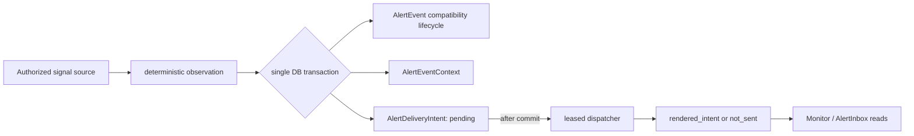

# C3 Monitor / Alert Runtime Contract (Phase 1)

**Status:** frozen implementation contract.  **Decision record:** red-team
review `RT-2026-07-20-758..774` (approved input). A later migration follows
Alembic revision `0065`; its exact future declaration is
`down_revision = "0065"`. This document does not allocate its revision id.

## Current truth and boundary

`NotificationEvent` is analyst-owned workflow state (including autonomy-draft
input). `AlertEvent` / `AlertState` is existing credit-change state and its
store, lifecycle, response fields, and APIs remain compatible. They are not
merged. C3 adds durable monitoring evidence and delivery work around the
existing alert lifecycle; it never turns fixtures, a draft, or a delivery into
publication/rating approval.

| Existing integration point | Impact / required preservation |
| --- | --- |
| `AlertEvent` | **CRITICAL** — 110 affected / 83 direct callers (lower-bound); additive tables only, no legacy field or lifecycle removal. |
| `AlertState` | **CRITICAL** — 110 affected / 83 direct callers (lower-bound); preserve its lifecycle and `alert_key` compatibility. |
| `database.py` insertion point | **CRITICAL** — 110 affected / 83 direct callers (exact); add related models only. |
| `CallerIdentity` in `caos/server/identity.py` | **CRITICAL** — 72 affected / 38 direct callers (exact); all new reads/writes use existing tenancy helpers and 404 masking. |
| `execute_run_by_id` | **LOW** — 5 affected / 2 direct callers (exact); run workers may create observations but may not dispatch or ratify. |

## Scope and visibility

Ownership is **analyst owner + immutable team snapshot**, with optional
`issuer_id` and `portfolio_id` scope. The snapshot records the team authorized
when the rule/version was created; it is not silently rewritten by later team
membership changes. Existing identity/tenancy helpers decide team authorization.
An inaccessible rule, event context, evaluation, or delivery intent is always
reported as **404**, never 403 or existence-bearing metadata.

| Operation | Owner | Team-authorized analyst | Admin | Other / missing scope |
| --- | --- | --- | --- | --- |
| Create, edit, enable/disable, version a rule | allow | deny | allow | 404 |
| Read rule, context, evaluation, intent | allow | allow | allow | 404 |
| Mutate a rule / retry or cancel an intent | allow | deny | allow | 404 |
| Existing `AlertEvent` state transition | current compatibility behavior | current compatibility behavior | current compatibility behavior | current compatibility behavior |

Every new read also applies optional issuer and portfolio scope. A rule with a
scope may observe only facts whose canonical subject is in that scope; a
scope-less rule is team-visible but never cross-tenant. Evaluations, contexts,
and intents each carry the `CallerIdentity`-derived owner/team snapshot and are
independently predicate-scoped on that stamped tenant/owner/team/scope before
being returned or mutated; a parent join cannot widen access.

## Signals and deterministic identity

Only these `signal_type` values are valid: `run_finding`, `qa_gate`,
`covenant`, `edgar_filing`, `market_move`, `cp1b_monitoring`,
`cp1c_peer_outlier`, `news`. `news` is reserved and unavailable in Phase 1:
rules using it cannot be enabled/evaluated.

The observation idempotency key is a SHA-256 of a canonical, versioned tuple:
`watch_rule_id | rule_version | signal_type | canonical_subject_scope |
immutable_source_or_fact_identity`. It **must not** include wall-clock time,
request id, rendered text, mutable source labels, or delivery state. The
canonical subject scope is tenant + issuer/portfolio identifiers (or explicit
null sentinels). Replays of the same immutable fact therefore resolve to one
evaluation/event context rather than a duplicate alert.

For every Phase-1 materialized observation, the legacy-compatible
`AlertEvent.alert_key` is exactly `c3:` plus the 64-character
`observation_key` (67 characters total). Insert-or-get uses the existing unique
index `uq_alert_events_alert_key` on `AlertEvent.alert_key`; it is the event
boundary, so one observation/evaluation cannot create multiple `AlertEvent`
rows. The matching legacy `AlertState` continues to use that same key under its
existing lifecycle contract.

Each evaluation has a UUID `correlation_id`; a root evaluation sets
`correlation_root_id = correlation_id`, and descendants retain that root.
`hop_count` is an integer in `0..3`; creation that would exceed 3 is rejected.

## Additive five-table persistence model

New-record `id` values are UUIDs; `alert_event_id` is deliberately the legacy
`AlertEvent.id` **`String(36)`**, not a UUID column. Timestamps are
timezone-aware UTC; `*_at` is nullable only where stated. JSON fields must
contain JSON objects, not arbitrary scalar/list payloads. Bounded strings reject
overlength input rather than truncating it.

| Table | Required fields | Constraints and indexes |
| --- | --- | --- |
| `watch_rules` | `id`, `tenant_id`, `owner_user_id`, `team_id_snapshot`, `issuer_id?`, `portfolio_id?`, `name varchar(160)`, `signal_type varchar(32)`, `enabled bool`, `current_version int`, `config_json jsonb`, `created_at`, `updated_at` | check signal enum and `current_version >= 1`; index `(tenant_id, owner_user_id)`, `(tenant_id, team_id_snapshot)`, `(tenant_id, issuer_id)`, `(tenant_id, portfolio_id)`. |
| `watch_rule_versions` | `id`, `watch_rule_id`, `version int`, `owner_user_id`, `team_id_snapshot`, `signal_type varchar(32)`, `config_json jsonb`, `created_at` | unique `(watch_rule_id, version)`; immutable after insert; index `(watch_rule_id, version desc)`. |
| `watch_rule_evaluations` | `id`, `tenant_id`, `owner_user_id`, `team_id_snapshot`, `issuer_id?`, `portfolio_id?`, `watch_rule_id`, `rule_version`, `signal_type varchar(32)`, `subject_scope_json jsonb`, `source_identity varchar(512)`, `observation_key char(64)`, `outcome varchar(24)`, `correlation_id`, `correlation_root_id`, `hop_count smallint`, `evaluated_at`, `detail_json jsonb` | unique `(tenant_id, observation_key)`; owner/team/scope are stamped from `CallerIdentity` and rule version; checks signal enum, outcome in `observed,matched,ignored,rejected`, `hop_count between 0 and 3`; indexes `(watch_rule_id, evaluated_at desc)`, `(correlation_root_id, evaluated_at)`, `(tenant_id, owner_user_id)`, `(tenant_id, team_id_snapshot)`. |
| `alert_event_contexts` | `id`, `tenant_id`, `owner_user_id`, `team_id_snapshot`, `issuer_id?`, `portfolio_id?`, `alert_event_id String(36)`, `watch_rule_evaluation_id`, `watch_rule_id`, `rule_version`, `signal_type varchar(32)`, `correlation_root_id`, `hop_count smallint`, `context_json jsonb`, `created_at` | owner/team/scope are stamped from `CallerIdentity` and evaluation; FKs to legacy alert event/evaluation/rule; unique `alert_event_id` and unique `watch_rule_evaluation_id` make the event↔evaluation context one-to-one; checks signal enum and `hop_count between 0 and 3`; indexes `(watch_rule_id, created_at desc)`, `(tenant_id, owner_user_id)`, `(tenant_id, team_id_snapshot)`. |
| `alert_delivery_intents` | `id`, `tenant_id`, `owner_user_id`, `team_id_snapshot`, `issuer_id?`, `portfolio_id?`, `alert_event_id String(36)`, `alert_event_context_id`, `channel varchar(24)`, `destination_ref varchar(256)`, `status varchar(24)`, `attempt_count smallint`, `max_attempts smallint`, `available_at`, `lease_token uuid?`, `lease_expires_at?`, `rendered_intent jsonb?`, `not_sent_reason varchar(256)?`, `correlation_root_id`, `created_at`, `updated_at` | owner/team/scope are stamped from `CallerIdentity` and context; unique `(alert_event_context_id, channel, destination_ref)`; checks channel in `in_app,email`, status in `pending,leased,rendered_intent,not_sent`, `attempt_count between 0 and max_attempts`, `max_attempts between 1 and 5`; indexes `(status, available_at)`, `(lease_expires_at)`, `(tenant_id, owner_user_id, created_at desc)`, `(tenant_id, team_id_snapshot)`. |

`config_json`, `detail_json`, and `context_json` are bounded to 64 KiB serialized;
`rendered_intent` is bounded to 256 KiB and contains the rendered payload or a
safe delivery-provider reference, never provider credentials. `destination_ref`
is an internal opaque reference, not an email address in normal logs.

## Transaction, leasing, and delivery

On a matched evaluation, insert/get the deterministic evaluation, create or
reuse the compatibility `AlertEvent`, insert `AlertEventContext`, and insert
deduplicated `AlertDeliveryIntent` rows **in one database transaction**.
Delivery workers atomically claim only committed eligible work: `pending` with
`available_at <= now` **or** `leased` with `lease_expires_at <= now`, and always
with `attempt_count < max_attempts`. One conflict-safe conditional transition
(or row lock with `FOR UPDATE SKIP LOCKED`) sets `status=leased`, increments
`attempt_count`, and replaces the opaque lease token/expiry; concurrent workers
cannot both claim it. An eligible row at its bound is transitioned atomically to
`not_sent`, never leased again. There is no process-local scheduler or
in-transaction network call. A worker must own the unexpired token to
complete/release a lease; an expired lease is reclaimed only by that transition.

The email-capable state machine is `pending -> leased -> rendered_intent` or
`not_sent`; its only terminal email statuses are `rendered_intent` and
`not_sent`. There is no `sent_at`, `sent`, or `delivered` field/status/claim:
`rendered_intent` means rendered/handed to the approved boundary, not accepted
by an enterprise transport. Retries are bounded by `max_attempts <= 5`, use
persisted `available_at`, and retain correlation root. Intent rows do **not**
copy `hop_count`: every authorized intent read joins its one-to-one event
context and returns that context's checked `hop_count`; it cannot diverge.
Ordinary logs contain ids, status, attempt count, and correlation ids only—never
rendered content, destinations, tokens, credentials, or source secrets.

## Allowed APIs and forbidden patterns

| API family | Contract |
| --- | --- |
| `POST/GET/PATCH /watch-rules` and version/enable actions | Owner/admin writes; scoped owner/team/admin reads; server derives tenant and identity. |
| `GET /watch-rules/{id}/evaluations`, `GET /alert-events/{id}/contexts` | Read-only, fully scope-checked, 404 masked. |
| `GET /alert-delivery-intents/{id}`, owner/admin retry/cancel action | Scoped; retry only requeues a terminal `not_sent` intent within the persisted bound. |
| Existing alert refresh/state endpoints and Monitor/Inbox reads | Keep response shapes and lifecycle behavior; enrich only through separately authorized context reads. |

Forbidden: a second alert/notification store; merging `NotificationEvent` with
`AlertEvent`; direct client writes to contexts/intents; an unscoped identifier
lookup; a false “sent” state; dispatch in the database transaction; process-local
scheduling/leases; automatic ratification, publication, or fixture-to-live
promotion; wall-clock-derived observation identity; and content or secrets in
ordinary logs.

## Migration, downgrade, and verification

The Phase-1 migration is additive with `down_revision = "0065"`: create these
five tables,
foreign keys, checks, indexes, and unique constraints without altering legacy
`AlertEvent` / `AlertState` columns or response schemas. Backfill is not
required. Downgrade first drops only FKs/indexes/tables in reverse dependency
order (`alert_delivery_intents`, `alert_event_contexts`,
`watch_rule_evaluations`, `watch_rule_versions`, `watch_rules`); it must not
delete or mutate legacy alerts/states.

Verification must prove: migration upgrade/downgrade on a populated legacy
database; deterministic replay yields one evaluation/context/intent set;
atomic rollback leaves no partial event/context/intent; concurrent workers hold
one durable lease; expiry/retry reaches `not_sent`; all scope permutations
return 404 where required; `news` cannot run; hop 4 is rejected; legacy alert
responses are byte-for-byte schema compatible; and logs contain no content or
secrets.
