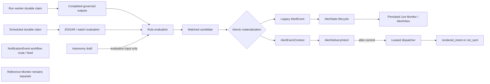

# C3 Monitor / Alert Runtime Contract (Phase 1)

**Status:** frozen Phase-1 runtime/storage contract. The implemented surfaces
described below are verified locally behind the default-off activation flag;
reserved HTTP APIs are identified explicitly and are not claimed as implemented.
**Decision record:** red-team review
`RT-2026-07-20-758..774` (approved input). Alembic revision `0066` implements
the additive five-table model. Revision `0067` adds bounded dialect storage
envelopes for the frozen JSON wire limits. Revision `0068` is the current head
and adds scoped durable watch-rule create idempotency.

## Current truth and boundary

`NotificationEvent` is analyst-owned workflow state (including autonomy-draft
input). `AlertEvent` / `AlertState` is existing credit-change state and its
store, lifecycle, response fields, and APIs remain compatible. They are not
merged. C3 adds durable monitoring evidence and delivery work around the
existing alert lifecycle; it never turns fixtures, a draft, or a delivery into
publication/rating approval.

| Existing integration point | Required preservation |
| --- | --- |
| `AlertEvent` | **CRITICAL surface** — additive tables only; no legacy field or lifecycle removal. |
| `AlertState` | **CRITICAL surface** — preserve its lifecycle and `alert_key` compatibility. |
| `database.py` model-registration seam | Add related models only; do not replace the legacy alert tables. |
| `CallerIdentity` in `caos/server/identity.py` | **CRITICAL surface** — preserve the global identity key while deriving the profile-backed C3 key. |
| `execute_run_by_id` | Run workers may create observations but may not dispatch or ratify. |
| `refresh_alert_events` | Preserve the compatibility refresh path. |
| `AlertInbox` | Keep it a persisted-alert compatibility reader. |

Fresh, parameterized GitNexus impact and final-diff measurements are recorded in
the candidate evidence rather than frozen here as brittle symbol counts.

## Scope and visibility

Ownership is **analyst owner + immutable team snapshot**, with optional
`issuer_id` and `portfolio_id` scope. The snapshot records the team authorized
when the rule/version was created; it is not silently rewritten by later team
membership changes. Existing identity/tenancy helpers decide team authorization.
All five watch-rule handlers require a profile-backed C3 capability. A proxy
principal with no persisted Analyst profile receives **403** before any rule
read/write. After capability is established, an inaccessible singular C3
resource is **404**-masked and list endpoints omit hidden rows.

Proxy identity deliberately has two keys. For cookie-less proxy resolution, the
global `CallerIdentity.id` remains the sanitized `X-Forwarded-User` value
(falling back to forwarded email) for both matched and unmatched callers,
preserving historical runs, settings, and other records. A valid profile cookie
exposes the profile UUID as the global id under the existing cookie contract. A
matched proxy profile also carries its persisted Analyst UUID separately as
`profile_id`; only the five watch-rule handlers and C3 alert-state attribution
substitute that UUID as the governed C3 owner.

A profile-less proxy cannot read contextual or orphan `c3:` alerts/states or
mutate C3 state, with tenancy either enabled or disabled and including an
`UNASSIGNED` team snapshot. Hidden C3 events/states are omitted from lists, and
C3 state mutation is masked as 404 before rate limiting or persistence. Legacy
alert routes remain reachable, but omit hidden C3 rows and retain compatibility
for legacy alert reads and caller-owned orphan legacy state.

| Operation | Owner | Team-authorized analyst | Admin | Other / missing scope |
| --- | --- | --- | --- | --- |
| Watch-rule create/edit/enable/disable | allow | deny, 404-masked after capability | allow | profile-less proxy: 403; other denial: 404 |
| Watch-rule list/get | allow | allow when scoped | allow | profile-less proxy: 403; hidden list row omitted / singular read 404 |
| Manual watch-rule evaluation | allow | deny, 404-masked after capability | allow | profile-less proxy: 403; other denial: 404 |
| Legacy alert transition | existing compatibility behavior | existing compatibility behavior | existing compatibility behavior | existing compatibility behavior |
| Contextual C3 alert transition | allow when visible | allow when visible | allow when visible | 404-masked; acting profile UUID is stamped |

Every new read also applies optional issuer and portfolio scope. A rule with a
scope may observe only facts whose canonical subject is in that scope; a
scope-less rule is team-visible but never cross-tenant. The rule's C3-scoped
profile UUID and team snapshot propagate through rule version → evaluation →
event context → delivery intent. Each persisted layer is predicate-scoped on
that tenant/owner/team/scope before internal use; a parent join cannot widen
access.

Scope authority is historical, not reconstructed from only the latest row.
Completed-run evaluation and materialization check issuer creation, portfolio
creation/update, and portfolio-position creation against the observation or
evaluation time recorded on the evaluation. A resource created or changed
after that time cannot retroactively authorize the historical observation.

## Signals and deterministic identity

Only these `signal_type` values are valid: `run_finding`, `qa_gate`,
`covenant`, `edgar_filing`, `market_move`, `cp1b_monitoring`,
`cp1c_peer_outlier`, `news`. `news` is reserved and unavailable in Phase 1:
rules using it cannot be enabled/evaluated.

The observation idempotency key is a SHA-256 of a canonical, versioned tuple:
`watch_rule_id | rule_version | signal_type | canonical_subject_scope |
immutable_source_or_fact_identity`. It **must not** include wall-clock time,
request id, rendered text, mutable source labels, or delivery state. The
canonical subject scope is tenant + issuer/portfolio identifiers (or explicit
null sentinels). Replays of the same immutable fact therefore resolve to one
evaluation/event context rather than a duplicate alert.

`subject_scope_json` is exactly a JSON object with these and no other keys:
`tenant_id` (UTF-8 string, 1–255 bytes), `issuer_id` (null or UTF-8 string,
1–36 bytes), and `portfolio_id` (null or UTF-8 string, 1–36 bytes). Arrays,
nested objects, numbers, booleans, missing `tenant_id`, additional keys, and
overlength strings are rejected. Its canonical UTF-8 JSON form sorts keys
lexicographically, uses no insignificant whitespace, and is at most 64 KiB;
that canonical form—not database JSON key order—is the
`canonical_subject_scope` input to the observation hash.

For every Phase-1 materialized observation, the legacy-compatible
`AlertEvent.alert_key` is exactly `c3:` plus the 64-character
`observation_key` (67 characters total). Insert-or-get uses the existing unique
index `uq_alert_events_alert_key` on `AlertEvent.alert_key`; it is the event
boundary, so one observation/evaluation cannot create multiple `AlertEvent`
rows. The matching legacy `AlertState` continues to use that same key under its
existing lifecycle contract.

Each evaluation has a UUID `correlation_id`; a root evaluation sets
`correlation_root_id = correlation_id`, and descendants retain that root.
`hop_count` is an integer in `0..3`; creation that would exceed 3 is rejected.
For every CP-SR↔CP-MON handoff, retain that root/correlation id and bounded
`hop_count`, suppress any return edge for the same `observation_key`, and never
auto-ratify or auto-publish.

## Additive five-table persistence model (`0066`)

New-record `id` values are UUIDs; `alert_event_id` is deliberately the legacy
`AlertEvent.id` **`String(36)`**, not a UUID column. Timestamps are
timezone-aware UTC; `*_at` is nullable only where stated. JSON fields must
contain JSON objects, not arbitrary scalar/list payloads. Bounded strings reject
overlength input rather than truncating it.

| Table | Required fields | Constraints and indexes |
| --- | --- | --- |
| `watch_rules` | `id`, `tenant_id`, `owner_user_id`, `team_id_snapshot`, `issuer_id?`, `portfolio_id?`, `create_idempotency_key varchar(128)?`, `create_request_sha256 char(64)?`, `name varchar(160)`, `signal_type varchar(32)`, `enabled bool`, `paused bool default false`, `current_version int`, `schedule_kind varchar(24)`, `schedule_interval_seconds?`, `next_evaluation_at?`, `schedule_cursor varchar(512)?`, `claim_token uuid?`, `claim_expires_at?`, `last_evaluated_at?`, `claim_attempt_count smallint default 0`, `config_json jsonb`, `created_at`, `updated_at` | check signal enum, `current_version >= 1`, schedule kind in `event_driven,interval,edgar`, interval in `60..86400` for `interval`/`edgar`, and attempt count in `0..5`; paired claim token/expiry; idempotency key/hash are both null or both non-null, with a bounded key and lowercase 64-hex hash; unique `(tenant_id, owner_user_id, create_idempotency_key)`; partial due-claim index `(next_evaluation_at, claim_expires_at) WHERE enabled AND NOT paused AND schedule_kind IN ('interval','edgar')`; scope indexes `(tenant_id, owner_user_id)`, `(tenant_id, team_id_snapshot)`, `(tenant_id, issuer_id)`, `(tenant_id, portfolio_id)`. |
| `watch_rule_versions` | `id`, `watch_rule_id`, `version int`, `owner_user_id`, `team_id_snapshot`, `signal_type varchar(32)`, `config_json jsonb`, `created_at` | unique `(watch_rule_id, version)`; immutable after insert; index `(watch_rule_id, version)`. |
| `watch_rule_evaluations` | `id`, `tenant_id`, `owner_user_id`, `team_id_snapshot`, `issuer_id?`, `portfolio_id?`, `watch_rule_id`, `rule_version`, `signal_type varchar(32)`, `subject_scope_json jsonb`, `source_identity varchar(512)`, `observation_key char(64)`, `outcome varchar(24)`, `correlation_id`, `correlation_root_id`, `hop_count smallint`, `evaluated_at`, `detail_json jsonb` | unique `(tenant_id, observation_key)`; owner/team/scope are stamped from the C3-scoped identity and rule version; checks signal enum, outcome in `observed,matched,ignored,rejected`, `hop_count between 0 and 3`; indexes `(watch_rule_id, evaluated_at)`, `(correlation_root_id, evaluated_at)`, `(tenant_id, owner_user_id)`, `(tenant_id, team_id_snapshot)`. |
| `alert_event_contexts` | `id`, `tenant_id`, `owner_user_id`, `team_id_snapshot`, `issuer_id?`, `portfolio_id?`, `alert_event_id String(36)`, `watch_rule_evaluation_id`, `watch_rule_id`, `rule_version`, `signal_type varchar(32)`, `correlation_root_id`, `hop_count smallint`, `context_json jsonb`, `created_at` | owner/team/scope are stamped from the C3-scoped identity and evaluation; FKs to legacy alert event/evaluation/rule; unique `alert_event_id` and unique `watch_rule_evaluation_id` make the event↔evaluation context one-to-one; checks signal enum and `hop_count between 0 and 3`; indexes `(watch_rule_id, created_at)`, `(tenant_id, owner_user_id)`, `(tenant_id, team_id_snapshot)`. |
| `alert_delivery_intents` | `id`, `tenant_id`, `owner_user_id`, `team_id_snapshot`, `issuer_id?`, `portfolio_id?`, `alert_event_id String(36)`, `alert_event_context_id`, `channel varchar(24)`, `destination_ref varchar(256)`, `status varchar(24)`, `attempt_count smallint`, `max_attempts smallint`, `available_at`, `lease_token uuid?`, `lease_expires_at?`, `rendered_intent jsonb?`, `not_sent_reason varchar(256)?`, `correlation_root_id`, `created_at`, `updated_at` | owner/team/scope are stamped from the C3-scoped identity and context; unique `(alert_event_context_id, channel, destination_ref)`; checks channel in `in_app,email`, status in `pending,leased,rendered_intent,not_sent`, `attempt_count between 0 and max_attempts`, `max_attempts between 1 and 5`; indexes `(status, available_at)`, `(lease_expires_at)`, `(tenant_id, owner_user_id, created_at)`, `(tenant_id, team_id_snapshot)`. |

`event_driven` rules have null `schedule_interval_seconds`,
`next_evaluation_at`, `schedule_cursor`, `claim_token`, `claim_expires_at`, and
`last_evaluated_at`, with `claim_attempt_count = 0`. `interval` and `edgar`
rules require `schedule_interval_seconds` in `60..86400`; when enabled and not
paused they require a non-null `next_evaluation_at`. A scheduled rule's claim
token and expiry are both null or both non-null. `paused` suppresses both event
and scheduled evaluation until an authorized owner/admin resumes it.

### Scheduled rule claims

Scheduled evaluation uses fields on `watch_rules`, never a sixth table. A worker
claims a rule with one atomic update whose predicate is: matching rule id,
`enabled = true`, `paused = false`, `schedule_kind IN ('interval','edgar')`,
`next_evaluation_at <= now`, `claim_attempt_count < 5`, and (`claim_token IS
NULL` or `claim_expires_at <= now`). The transition sets a fresh UUID
`claim_token`, sets `claim_expires_at = now + 5 minutes`, and increments
`claim_attempt_count` once. Its row predicate / lock makes a successful claim
exclusive; expired claims are reclaimed only through the same transition.

Completion or failure uses an atomic update requiring the matching token and
`claim_expires_at > now`. It persists the supplied (or unchanged) bounded
cursor, sets `last_evaluated_at = now`, calculates the next interval slot on
success or a bounded exponential backoff on failure, and clears both claim
fields. Success resets `claim_attempt_count` to zero. At the fifth failed
claim, it instead sets `paused = true`, clears `next_evaluation_at`, and leaves
the rule for an authorized resume/reset; it cannot be claimed again. Scheduled
verification must cover two concurrent claimers (one wins), expired-lease
reclaim, token-required completion/failure, successful next-slot calculation,
failure backoff, and the fifth-failure pause.

Only an explicit authorized update from `paused = true` to `paused = false`
resumes a terminal scheduled rule. That transition resets
`claim_attempt_count` to zero and preserves the durable `schedule_cursor` and
`last_evaluated_at` watermark. It does not silently replay from the beginning
or discard the last completed position.

### Foreign keys, uniqueness, and deletion

`alert_events` is the exact legacy `AlertEvent` table name. Migration `0066`
enforces all listed foreign keys (FKs); every FK column has an index unless the
named unique index covers it. Every application SQLite connection also executes
`PRAGMA foreign_keys=ON`.

The server suite keeps that runtime pragma enabled. A test-only transaction
hook applies `PRAGMA defer_foreign_keys=ON` at each SQLite transaction boundary
so valid unordered fixture graphs can settle before commit. Commit-time FK
enforcement remains active: unresolved orphans still fail.

| Child relation | Exact target / required unique target | Delete rule |
| --- | --- | --- |
| `watch_rule_versions.watch_rule_id` | `watch_rules.id` | **RESTRICT**; rules and versions are disabled/paused, never hard-deleted. |
| `watch_rule_evaluations.watch_rule_id` | `watch_rules.id` | **RESTRICT**. |
| `watch_rule_evaluations.(watch_rule_id, rule_version)` | `watch_rule_versions.(watch_rule_id, version)` | **RESTRICT**; requires unique `(watch_rule_id, version)`. |
| `alert_event_contexts.alert_event_id` | `alert_events.id` (`String(36)`) | **CASCADE** for authorized legacy-alert erasure. |
| `alert_event_contexts.watch_rule_evaluation_id` | `watch_rule_evaluations.id` | **RESTRICT**. |
| `alert_event_contexts.watch_rule_id` and `(watch_rule_id, rule_version)` | `watch_rules.id` and `watch_rule_versions.(watch_rule_id, version)` | **RESTRICT** for both rule/version links. |
| `alert_delivery_intents.alert_event_context_id` | `alert_event_contexts.id` | **CASCADE** for authorized legacy-alert erasure. |
| `alert_delivery_intents.alert_event_id` | `alert_events.id` (`String(36)`) | **CASCADE** for authorized legacy-alert erasure. |

Required keys/indexes are: legacy `uq_alert_events_alert_key`; unique
`watch_rule_versions(watch_rule_id, version)` (the composite FK target); unique
`watch_rule_evaluations(tenant_id, observation_key)`; unique
`alert_event_contexts(alert_event_id)` and
`alert_event_contexts(watch_rule_evaluation_id)`; and unique
`alert_delivery_intents(alert_event_context_id, channel, destination_ref)`.
Indexes cover every standalone FK and the leading columns of each composite FK.

The privileged analyst-erasure workflow is the only path allowed to
dependency-delete an analyst-owned C3 graph (intents, contexts, evaluations,
versions, then rules); ordinary product paths retain the RESTRICT/no-delete
contract. Self-erasure always supplies the persisted profile UUID and canonical
email. It additionally supplies the active forwarded-user/email principal only
when `X-Forwarded-Email` case-insensitively matches the authenticated
`caller.email`; mismatched headers cannot broaden erasure. Operator email lookup
resolves the profile UUID and passes its stored canonical email into erasure,
which completely removes that profile's C3 graph. Neither path can infer a
different historical proxy subject that is not stored on the Analyst row; that
pre-existing limitation is not represented as operator coverage.

Proxy identity resolution, SSO profile creation, and operator email erasure read
at most two ordered case-insensitive Analyst matches and fail closed on
ambiguity. Document erasure uses the same exact-equality predicate, never
substring matching. SQLite registers deterministic `caos_unicode_lower` on
every application connection; PostgreSQL uses `lower()`. SSO creation stores
normalized email, and one unambiguous legacy mixed-case row is normalized in
place. Email occurrences in retained bystander-owned alert, lifecycle, and
delivery content are scrubbed case-insensitively, while analyst ids remain exact
matches so case variants of an id are not over-redacted. The bystander's records
and identity survive; only the erased analyst's embedded identity is removed.

`config_json`, `detail_json`, and `context_json` are bounded to 64 KiB serialized;
`rendered_intent` is bounded to 256 KiB and contains the rendered payload or a
safe delivery-provider reference, never provider credentials. `destination_ref`
is an internal opaque reference, not an email address in normal logs.

Revision `0067` leaves those canonical wire limits unchanged. It replaces the
raw database JSON-size checks with bounded, dialect-specific storage envelopes
that accommodate JSON/JSONB serialization overhead while retaining object-type
checks and finite caps. Its downgrade preflight refuses to restore the tighter
`0066` checks when any stored value exceeds the corresponding `0066` maximum;
the refusal occurs before constraint mutation. Offline downgrade refuses before
emitting any operation because it cannot inspect the protected live rows.

Revision `0068` leaves legacy and keyless rows readable but requires every new
HTTP create to supply `Idempotency-Key`. The server validates a 1..128-character
key from the frozen safe alphabet, hashes the fully validated semantic command
as canonical finite JSON, and converges concurrent replicas through the scoped
database unique key. An exact replay returns the winning rule; reusing the key
for changed intent returns `409 watch_rule_idempotency_conflict`. Its downgrade
preflight refuses before DDL when any durable create-idempotency record is
populated. Offline downgrade likewise refuses before emitting DDL. Operational
rollback remains flag-off with `0068` retained.

## Transaction, leasing, and delivery

On a matched evaluation, insert/get the deterministic evaluation, create or
reuse the compatibility `AlertEvent`, insert `AlertEventContext`, and insert
deduplicated `AlertDeliveryIntent` rows **in one database transaction**.
Delivery workers atomically claim only committed eligible work: `pending` with
`available_at <= now` **or** `leased` with `lease_expires_at <= now`, and always
with `attempt_count < max_attempts`. One conflict-safe conditional transition
(or row lock with `FOR UPDATE SKIP LOCKED`) sets `status=leased`, increments
`attempt_count`, and replaces the opaque lease token/expiry; concurrent workers
cannot both claim it. An eligible row at its bound is transitioned atomically to
`not_sent`, never leased again. There is no process-local scheduler or
in-transaction network call. A worker must own the unexpired token to
complete/release a lease; an expired lease is reclaimed only by that transition.

The email-capable state machine is `pending -> leased -> rendered_intent` or
`not_sent`; its only terminal email statuses are `rendered_intent` and
`not_sent`. There is no `sent_at`, `sent`, or `delivered` field/status/claim:
`rendered_intent` means rendered and persisted locally only. It has not been
handed to, accepted by, or sent through an enterprise transport. Retries are
bounded by `max_attempts <= 5`, use persisted `available_at`, and retain
correlation root. Intent rows do **not** copy `hop_count`; internal consumers
derive it from the one-to-one event context, so the two values cannot diverge.
Ordinary logs contain ids, status, attempt count, and correlation ids only—never
rendered content, destinations, tokens, credentials, or source secrets.

## Allowed APIs and forbidden patterns

| API family | Contract |
| --- | --- |
| Implemented watch-rule HTTP surface: `POST /watch-rules`, `GET /watch-rules`, `GET/PATCH /watch-rules/{id}`, `POST /watch-rules/{id}/evaluate` | Profile-backed C3 capability; owner/admin writes; scoped owner/team/admin reads; server derives tenant and identity. Every create requires a valid `Idempotency-Key`; exact retries converge and changed intent under that key returns the stable conflict above. Enable/disable/version changes use `PATCH`. |
| Implemented legacy alert HTTP surface: refresh/state/events reads and state/event mutation | Preserve response shapes and legacy lifecycle behavior. Contextual C3 rows add owner/team/admin visibility, omit or 404-mask denials, and stamp the acting profile UUID; local/test C3 owners keep their existing C3 identity. |
| Reserved evaluation/context/intent HTTP reads and retry/cancel actions | **Not implemented in Phase 1.** No public evaluation-list, context-read, intent-read, intent-retry, or intent-cancel endpoint is claimed by this contract. |
| `python -m reconcile_alert_rules --limit N [--cursor OPAQUE]` | Explicit operator-only, bounded completed-run replay. It refuses flag-off execution, processes one page, and exits; no timer or startup hook invokes it. A non-null `next_cursor` advances the input. On a clean terminal page, `next_cursor = null` means retain the input cursor; recurring operation intentionally replays that terminal page until a future durable high-water-mark protocol exists. |

Forbidden: a second alert/notification store; merging `NotificationEvent` with
`AlertEvent`; direct client writes to contexts/intents; an unscoped identifier
lookup; a false “sent” state; dispatch in the database transaction; process-local
scheduling/leases; automatic ratification, publication, or fixture-to-live
promotion; wall-clock-derived observation identity; and content or secrets in
ordinary logs.

## Persisted Monitor mutation and recovery authority

The desktop and phone Monitor use one persisted controller and enforce a
two-way mutation barrier: an individual transition blocks a batch containing
that event, and an in-flight batch blocks ordinary row transitions. A partial
batch failure retains only failed event ids for selection and retry. A newer
authoritative refresh invalidates stale local retry authority.

The event lifecycle `PATCH` treats omitted workflow metadata as no change.
Acknowledgement and resolution preserve an omitted assignee, note, or prior
resolution note. An explicitly supplied null or blank assignee/note still
normalizes to a deliberate clear.

Failed ordinary refreshes keep the prior ready surface mounted and preserve
workflow custody, including the current analyst input, retry action, dataset,
and responsive mode. The analyst must either complete the transition or dismiss
that custody. The acknowledgement recovery copy states that input was preserved
and the workflow transition remains available to retry:
`Input was preserved. The workflow transition is available to retry.`

Rule collection authority is separate from historical alert authority. A rule
settings/list refresh that revokes mutation authority closes writable editor
state and clears its draft atomically. Browser surface fixtures own the complete
alert-event and watch-rule URL prefixes for every method, return a fresh mutable
clone for each installation, and never fall through to a live backend.

The create editor retains one operation key across an ambiguous retry. If the
server proves that key already committed a different request, the editor closes
and clears the changed draft, refreshes the persisted collection, and directs
the analyst to review the existing rule before starting a new intent. It never
offers the edit-only version-conflict reload action for a create conflict.

At desktop width, supporting context/inspector rails must not own unexpected
horizontal scroll and every visible rule-control label/action must remain inside
the inspector rail. The accessibility harness checks both clipped controls and
`scrollWidth - clientWidth` on supporting rails at 1440×900 and 390×844, under
normal and reduced motion; the browser regression independently checks the
desktop inspector bounds.

Phase 1 deliberately accepts a low-volume pilot scale boundary: the persisted
controller drains the full alert history, the UI renders that history, and
material-change rows fetch decision context per row. This is correctness-first
and is not production-capacity evidence. Before higher-volume activation, add a
server-windowed history/read model and a batched decision-context endpoint, then
measure the target-host envelope. Governed evidence uses one primary chunk when
present (otherwise the exact run/QA finding); multiple chunk references are not
silently aggregated into one conclusion.

## Wire contracts

All five public wire models are Pydantic v2 models with forbidden extra fields,
frozen instances, stripped string whitespace, and timezone-aware datetimes.
Bounded JSON objects are measured in their canonical UTF-8 encoding (sorted
keys, no insignificant whitespace). The contracts contain no
`sent`/`delivered`/`accepted`/`connected` delivery vocabulary. U+0000 is rejected
from bounded JSON and from every scalar string that can enter JSONB—including
`SignalObservation.source_identity`, `categorical_value`, and every
`source_artifact_refs` item—at construction and again at each persistence
boundary because PostgreSQL JSONB cannot represent it.

`SubjectScope` is the shared helper: `tenant_id` is a string of 1..255 UTF-8
bytes; `issuer_id` and `portfolio_id` are optional strings of 1..36 UTF-8 bytes;
extra keys are forbidden; and the canonical JSON object is at most 64 KiB.

- `SignalObservation`: `signal_type` is the exact frozen signal literal;
  `subject_scope` is `SubjectScope`; `source_identity` is a 1..512-character
  immutable fact/source identity; `observed_at` is aware; `numeric_value` is a
  finite float or null; `categorical_value` is a string of at most 512
  characters or null; `detail` is a JSON object bounded to 64 KiB;
  `source_artifact_refs` is a tuple of at most 64 strings, each at most 512
  characters; correlation and correlation-root ids are UUIDs; and `hop_count`
  is 0..3. At least one of numeric value, categorical value, or non-empty detail
  is required.
- `EvaluationTrigger`: `trigger_kind` is one of `run_completed`, `manual`,
  `scheduled_edgar`, or `scheduled_watchlist`; `trigger_identity` is a 1..512
  string; `watch_rule_id` is a UUID; `rule_version >= 1`; `occurred_at` is
  aware; `scheduled_for` is aware or null; correlation and correlation-root ids
  are UUIDs; and `hop_count` is 0..3. `scheduled_for` is required exactly for
  scheduled kinds and forbidden otherwise.
- `AlertCandidate`: `evaluation_id` and `watch_rule_id` are UUIDs;
  `rule_version >= 1`; `observation_key` is exactly 64 lowercase hexadecimal
  characters; `alert_key` is exactly `c3:` plus that observation key;
  `signal_type` and `subject_scope` use the shared types; optional `issuer_id`
  and `portfolio_id` must equal the corresponding scope value; `run_id` is at
  most 64 characters; `kind` is 1..64 characters; `title` is 1..240 characters;
  `impact` is at most 4,000 characters; `evidence` and `authority` are JSON
  objects bounded to 64 KiB; correlation and correlation-root ids are UUIDs;
  and `hop_count` is 0..3. Key and scope mismatches are rejected.
- `SinkIntent`: `channel` is `in_app` or `email`; `destination_ref` is a 1..256
  string; `idempotency_key` is exactly 64 lowercase hexadecimal characters;
  `status` is `pending`, `rendered_intent`, or `not_sent`; `rendered_intent` is
  a JSON object bounded to 256 KiB or null; and `not_sent_reason` is at most 256
  characters or null. A rendered payload is required only for
  `rendered_intent`; a reason is required only for `not_sent`.
- `SinkResult`: `channel` uses the same channel literal; `status` is
  `rendered_intent` or `not_sent`; `intent_id` is a UUID or null;
  `attempt_count` is 0..5; and `error_class` is at most 64 characters or null.
  It has no free-form provider response or content field.

## Migration, downgrade, and verification

Revision `0066` is additive with `down_revision = "0065"`: it creates these five
tables, foreign keys, checks, indexes, and unique constraints without altering
legacy `AlertEvent` / `AlertState` columns or response schemas. Backfill is not
required. Its downgrade first drops only the new FKs and dependent indexes,
then tables in exact reverse dependency order: `alert_delivery_intents`,
`alert_event_contexts`, `watch_rule_evaluations`, `watch_rule_versions`, and
`watch_rules`. It must not delete or mutate legacy alerts/states.

Revision `0067` has `down_revision = "0066"` and changes only the bounded storage
checks described above. Its online downgrade performs the incompatible-row
preflight before replacing any check and restores the SQLite rule-version
immutability trigger after table reconstruction; offline downgrade fails before
any DDL. Revision `0068` has
`down_revision = "0067"` and is the current Alembic head. It adds only the
nullable paired create-idempotency columns, their check, and their scoped unique
constraint; populated-ledger downgrade refusal occurs before constraint or
column mutation, and offline downgrade also fails before any DDL.

Verification must prove: migration upgrade/downgrade on a populated legacy
database; deterministic replay yields one evaluation/context/intent set;
atomic rollback leaves no partial event/context/intent; concurrent workers hold
one durable lease; expiry/retry reaches `not_sent`; all scope permutations
return 404 where required; profile-less proxies cannot access or adopt C3
alerts/states while legacy compatibility remains; `news` cannot run; hop 4 is rejected; legacy alert
responses are byte-for-byte schema compatible; scheduled claims have one winner,
reclaim safely after expiry, and require the token to finish; and logs contain
no content or secrets.
