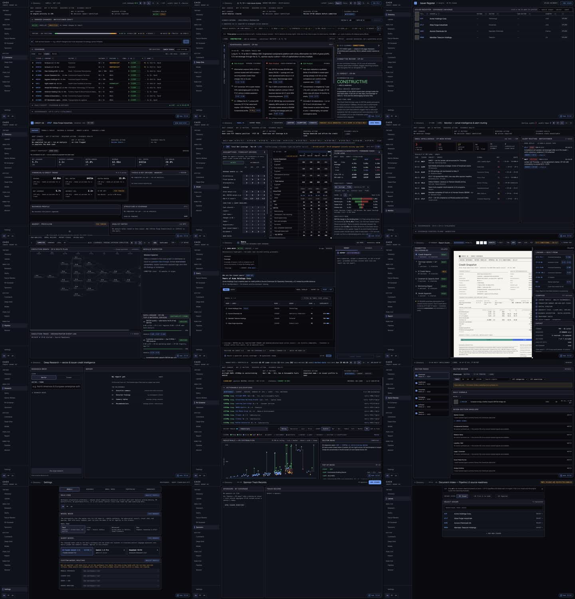
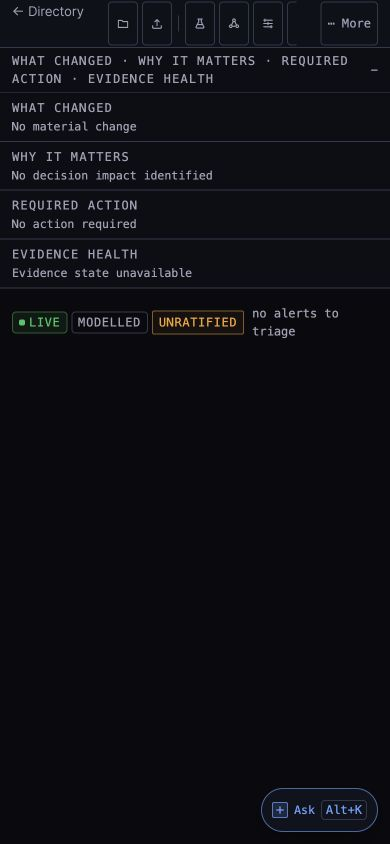

# CAOS Decision Workbench — completion captures

Captured from the production export served by the local FastAPI stack at a 1440 × 900 desktop viewport, plus the intentional 390 × 844 phone-triage state.

## Individual surfaces

- [Command](screenshots/command-desktop.jpg)
- [Deep-Dive](screenshots/deep-dive-desktop.jpg)
- [Directory](screenshots/directory-desktop.jpg)
- [Issuer Profile](screenshots/issuer-profile-desktop.jpg)
- [Model Builder](screenshots/model-desktop.jpg)
- [Monitor](screenshots/monitor-desktop.jpg)
- [Pipeline](screenshots/pipeline-desktop.jpg)
- [Query](screenshots/query-desktop.jpg)
- [Report Studio](screenshots/report-studio-desktop.jpg)
- [Research](screenshots/research-desktop.jpg)
- [Sector Review](screenshots/sector-review-desktop.jpg)
- [RV Screener](screenshots/rv-screener-desktop.jpg)
- [Settings](screenshots/settings-desktop.jpg)
- [Sponsors](screenshots/sponsors-desktop.jpg)
- [Upload](screenshots/upload-desktop.jpg)
