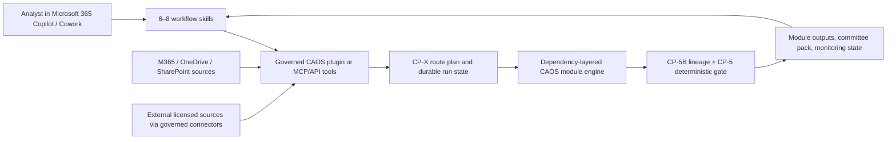

# CAOS System Optimisation and Microsoft 365 Copilot Skills Assessment

**Date:** 15 July 2026  
**Scope:** Modular OS methodology corpus, CAOS FastAPI execution engine, analyst UI and deployment posture, Microsoft 365 Copilot deployment constraints, the shared Gemini discussion, and standalone-skill orchestration options.  
**Assessment mode:** code- and test-backed review; no production logic changed.

## Executive conclusion

CAOS is analytically strong and structurally more mature than a prompt library. Its defensible core is the combination of a governed 26-module methodology corpus, deterministic routing and calculations, explicit source lineage, schema-constrained LLM synthesis, and a post-run integrity gate. The main weakness is no longer basic architecture: it is incomplete convergence between the full corpus, the runtime, and the product surfaces.

The recommended Copilot deployment is therefore **hybrid**:

1. keep CP-X routing, calculations, persistence, source identity, module ownership, and CP-5 gates in the CAOS backend;
2. expose a small, coarse-grained CAOS tool surface to Microsoft 365 Copilot through a governed plugin or MCP/API layer; and
3. use Cowork skills as analyst-facing workflow packages, not as 26 independent replacements for the engine.

A direct one-skill-per-module port is technically plausible for individual modules, but it is not a safe production operating model. The complete portfolio exceeds the conservative documented Cowork skill-count limit, and Copilot's description-based orchestration does not provide the deterministic dependency, state, retry, lineage, and gate semantics that CAOS already has.

The Gemini discussion contains several useful ideas—progressive skill disclosure, companion files, a shared run state, and a modular skill portfolio—but overstates autonomy, understates tenant administration, confuses OneDrive `.agent` files with Cowork skills, treats a recommended 5,000-token skill body as a hard platform limit, and proposes a repository/runtime architecture that does not exist in this codebase.

## 1. What exists today

CAOS is best understood as three related systems, not one monolithic prompt:

| System | Current state | Assessment |
|---|---|---|
| **Modular OS methodology** | 26 active prompt modules spanning intake, canonical financials, fundamental risk, relative value, legal/covenant work, integrity QA, debate, sector review, monitoring, and routing | Strongly governed and internally consistent; richer than the runtime currently consumes |
| **CAOS analytical runtime** | 21 implemented registry modules: 19 default analytical modules plus feature-gated CP-2G and CP-4D; CP-5B/CP-5 operate as the post-run gate phase; four additional modules are registered spec-only | Mature deterministic/LLM hybrid with real orchestration, but only CP-2G and CP-4D consume a complete manifest-verified prompt bundle |
| **Product and deployment surface** | Six-concept Next.js application backed by FastAPI, Postgres, Caddy, and oauth2-proxy; live-engine paths coexist with seeded/offline fallbacks | Usable and well-tested, but several decision surfaces are still demo/fallback-backed rather than end-to-end live |

The source-of-truth runtime inventory is [`caos/server/engine/registry.py`](../caos/server/engine/registry.py). CP-X is implemented as routing/planning logic rather than a normal registry module, while CP-5B and CP-5 are executed as the post-synthesis lineage and severity-gate phase in [`runner.py`](../caos/server/engine/runner.py).

### Current execution model

The present engine already incorporates several optimisations that older reports proposed:

- CP-X produces the route plan and the runner forms dependency-safe layers.
- Independent modules within a layer synthesize concurrently; session-bound modules remain serial.
- The issuer BM25 index is constructed once per run and reused.
- LLM calls use forced structured output, prompt caching, a bounded output budget, and one repair attempt.
- CP-5B resolves claims to ingested source chunks and CP-5 makes the deterministic clearance decision.
- A blocked upstream module propagates a committee-status cap through its descendants.
- Fixture mode keeps the orchestration, persistence, lineage, and gate paths testable without a model key.

These are genuine strengths. Recommending “add parallel execution,” “add structured output,” or “cache prompts” as new work would now be stale.

## 2. Strengths

### 2.1 Analytical methodology

- **Clear evidence discipline.** The corpus repeatedly enforces evidence → mechanic → implication, source hierarchy, confidence downgrades, and null/blocked states instead of invented precision.
- **Specialist decomposition.** Financial normalization, downside, liquidity, governance, relative value, recovery, covenant interpretation, capacity, debate, and monitoring have distinct analytical ownership.
- **Committee-oriented outputs.** The methodology is designed around a defensible credit view, not generic summarisation.
- **Governed handoffs.** The current common preamble, module manifests, schemas, and execution-order documentation define dependencies and owned outputs explicitly.
- **Corpus consistency is currently green.** The repository checker assessed all 26 active prompt modules with zero reported drift.

### 2.2 Runtime architecture

- **Deterministic control plane.** Routing, dependency order, persistence, financial calculations, lineage, and gate decisions do not depend solely on model judgment.
- **Honest degradation.** Missing sources or invalid output can produce Blocked/Insufficient Information rather than a plausible-looking answer.
- **Schema-constrained synthesis.** The live path forces an `emit_module_payload` tool call and validates the result before persistence.
- **Fault isolation.** A synthesis failure is captured as a gated module result instead of discarding already completed peer work.
- **Traceability.** Outputs carry model/run metadata and, for the full-bundle modules, bundle fingerprints and file lists.
- **Testing depth.** Focused engine tests cover planning, registry invariants, layer execution, fault isolation, prompt bundles, live synthesis, lineage, and CP-5 honesty.

### 2.3 Product and operational posture

- **Institutional UX intent.** The interface is designed for dense analytical work and committee traceability rather than consumer-dashboard simplicity.
- **Explicit live/demo labeling.** The current audit acknowledges seeded surfaces and offline fallbacks instead of presenting all screens as live.
- **Reproducible offline mode.** A deterministic fixture path supports development and regression testing.
- **Production-shaped deployment.** The repository includes the application, authentication proxy, reverse proxy, database, retention, backup, security, and deployment documentation expected of a self-hosted stack.

## 3. Weaknesses and optimisation risks

### 3.1 Corpus/runtime parity is incomplete

Of the 21 implemented registry modules, CP-2G and CP-4D load their complete manifest-verified bundles. The other 19 implemented modules load only their `*_ACTIVE_PROMPT.md` file. Their reference files, shared preamble, schemas, examples, and module-specific governance therefore remain corpus assets rather than guaranteed runtime context.

This is the largest analytical-quality risk because it creates two definitions of “the module”: the full governed folder and the subset actually seen by the live synthesizer. It also makes a future Copilot port vulnerable to selecting a third, manually copied definition.

**Optimisation implication:** do not merely concatenate every file into every call. Generalise the verified bundle loader, then progressively load required rules and references while stamping the exact file set and hash on each output.

### 3.2 QA clearance has explicit blind spots

The CP-5 active prompt accurately records that:

- no full deterministic lane-5 cross-module consistency sweep exists; and
- lane 8 export content is not assessed under any configuration.

The existing gate is valuable, but an unexercised lane must mean **not assessed**, not passed. Export integrity and cross-module contradictions are exactly the areas where a modular Copilot workflow could silently fragment.

### 3.3 Runtime and UI are not yet fully converged

The live engine produces more than the UI currently exposes, while several visible areas still use seeded data or fallback paths. The repository audit identifies remaining gaps in much of Deep-Dive, Pipeline simulation, Monitor, CP-3 relative-value/recovery surfaces, and CP-6A presentation. CP-SR and CP-MON remain registered but spec-only; CP-RENDER and CP-EXTRACT also remain spec-only.

This produces a credibility risk: the product can look more complete than its live end-to-end data path. Copilot should not become another presentation layer over partially seeded state without explicit provenance labels.

### 3.4 Documentation and environment truth have drifted

- The onboarding document opens with 27 agents and later reports 29; the active prompt corpus contains 26 module folders, while the runtime registry has a different execution inventory.
- Root documentation still describes the 19 default modules but does not consistently foreground the two implemented feature-gated modules.
- The local `.venv` is Python 3.9 and incompatible with the current code/dependencies; `.venv311` is the supported working environment.

These are not cosmetic problems. Counts and runtime claims are part of the governance contract and will feed any generated Copilot package metadata.

### 3.5 Optimisation lacks a complete non-regression benchmark

The codebase has strong unit and integration tests, but a prompt/runtime optimisation needs a stable analytical evaluation corpus covering:

- numerical accuracy and metric-definition consistency;
- citation resolution and source quality;
- schema validity and gate outcomes;
- cross-module contradiction rate;
- expert credit judgment or pairwise preference;
- input/output tokens, latency, retries, and cost by module; and
- critical-path latency for representative run types.

Without this, shortening prompts or changing retrieval can improve speed while invisibly weakening analytical quality.

## 4. The 8,000-character Copilot constraint

The 8,000-character ceiling applies to **declarative-agent instructions**. Microsoft explicitly documents the limit and advises against moving behavioural instructions into SharePoint knowledge files as a workaround: knowledge should supply facts and grounding, while the instruction field governs behaviour ([declarative agent instructions](https://learn.microsoft.com/en-us/microsoft-365/copilot/extensibility/declarative-agent-instructions), [best practices](https://learn.microsoft.com/en-us/microsoft-365/copilot/extensibility/declarative-agent-best-practices)).

It does **not** apply in the same way to a Cowork `SKILL.md`. Current Cowork documentation allows a `SKILL.md` of up to 1 MB and recommends progressive disclosure, with a skill body targeted below roughly 5,000 tokens and larger references loaded on demand ([use Cowork](https://learn.microsoft.com/en-us/microsoft-365/copilot/cowork/use-cowork), [Cowork plugin development](https://learn.microsoft.com/en-us/microsoft-365/copilot/cowork/cowork-plugin-development)).

### Current prompt fit

Measured as Unicode characters, 14 of the 26 active prompts exceed 8,000 characters:

| Module | Characters | Excess over 8,000 |
|---|---:|---:|
| CP-1 | 8,307 | 307 |
| CP-2 | 8,044 | 44 |
| CP-2D | 9,917 | 1,917 |
| CP-2E | 9,439 | 1,439 |
| CP-2F | 8,861 | 861 |
| CP-3 | 9,932 | 1,932 |
| CP-3B | 9,848 | 1,848 |
| CP-3C | 8,359 | 359 |
| CP-3D | 9,218 | 1,218 |
| CP-4 | 9,869 | 1,869 |
| CP-4C | 10,345 | 2,345 |
| CP-5 | 11,501 | 3,501 |
| CP-6A | 12,304 | 4,304 |
| CP-6E | 12,481 | 4,481 |

A direct copy into declarative-agent instructions will therefore fail for more than half of the portfolio. Character counts also leave no operational headroom for future changes.

### Loss-minimising compression method

For declarative agents, generate a compact runtime instruction from the canonical module bundle with a target of **7,000–7,200 characters**, leaving 10–12.5% headroom. Keep only:

1. role, scope, and non-goals;
2. hard source and calculation rules;
3. workflow transitions and stopping conditions;
4. input/output contracts;
5. failure and uncertainty behaviour; and
6. tool-selection rules.

Move factual material—not behavioural controls—to governed references:

- taxonomies and controlled vocabularies;
- formula definitions and examples;
- covenant clause dictionaries;
- long source-routing matrices;
- output examples; and
- explanatory background.

Further safe reductions:

- replace repeated prose with compact tables and shared controlled terms;
- remove duplicate negative/positive restatements while retaining the operative rule;
- reference stable tool names and schema fields rather than restating their full shape;
- keep exact numerical/legal hard stops verbatim in the canonical source and regression-test the generated compact form; and
- never hand-edit the compact and full versions independently.

Compression should be accepted only when the analytical evaluation suite is non-inferior on accuracy, source fidelity, gate severity, and expert preference.

## 5. Assessment of the shared Gemini discussion

The shared conversation was assessed against the current repository and current Microsoft documentation.

| Gemini idea or claim | Assessment | Corrected position |
|---|---|---|
| Store a Cowork skill under `OneDrive/Documents/Cowork/Skills/<skill>/SKILL.md` | **Supported** | This is the documented personal-skill location. |
| No administrator is needed | **Incorrect/overstated** | Cowork is a Frontier/preview capability and tenant admins control availability, usage-based billing, discoverability, models, plugins, and related governance ([admin and governance](https://learn.microsoft.com/en-us/microsoft-365/copilot/cowork/cowork-admin-governance)). |
| A third-person description makes the skill autonomously trigger | **Unproven framing** | Descriptions help Copilot select skills/actions; they do not create a deterministic trigger or guarantee a multi-step chain. |
| `SKILL.md` has a hard 5,000-token cap | **Incorrect** | About 5,000 tokens is progressive-disclosure guidance for the body. The documented hard `SKILL.md` size is 1 MB. |
| Companion documents can hold detailed rules and templates | **Useful and supported** | Companion files are appropriate for reference content, with safe relative paths and documented package limits. They should not become an unversioned bypass for behavioural controls. |
| Create a `.agent` file in OneDrive | **Real but a different product primitive** | A OneDrive agent is a Q&A agent grounded in selected OneDrive/SharePoint content, with up to 20 sources; it is not equivalent to a Cowork skill or the CAOS execution engine ([OneDrive agents](https://support.microsoft.com/en-us/onedrive/copilot/create-and-use-an-agent-in-onedrive)). |
| Cowork can draft email, schedule, and act across Microsoft 365 | **Broadly supported, with controls** | Cowork can perform multi-step Microsoft 365 work, but sensitive actions remain approval- and policy-governed; it should not be treated as unattended credit approval. |
| External data is unavailable | **Too absolute** | Built-in Microsoft 365 services are available and external capabilities can be added through plugins/connectors/MCP, subject to tenant administration and security. |
| Use Claude through Cowork | **Possible, not deterministic** | Current Cowork governance exposes multiple models and an Auto choice; a particular Claude model is not guaranteed unless the tenant/user can select and fix it ([Cowork models](https://learn.microsoft.com/en-us/microsoft-365/copilot/cowork/cowork-models)). |
| Build `core/agents/L0-L6`, LangGraph runtime graphs, Bloomberg/Capital IQ connectors, and an Obsidian knowledge bank | **An invented target architecture** | Those structures are not the current CAOS repository. The real system is `Modular OS/` plus the FastAPI engine and Next.js application. Any connector or orchestration migration must be justified against that baseline, not assumed to exist. |
| Package CP-4 with a `covenant_red_lines.md` companion | **Good packaging pattern, weak module fidelity** | CP-4 is a much richer legal/covenant methodology and the named file does not exist. A real package must be generated from the actual CP-4 manifest and references, including source gates, clause traceability, uncertainty, and legal-review boundaries. |
| Keep the skill private until shared | **Incomplete governance statement** | Tenant policies, Purview/audit, connector permissions, billing, and admin controls still apply even before broad sharing. |

### Net judgment on the Gemini proposal

The conversation is directionally valuable as a **prototype packaging concept**. Its strongest ideas are:

- a small `SKILL.md` plus progressively loaded companions;
- an explicit state/manifest file;
- modular analyst workflows rather than one giant prompt; and
- clear descriptions and activation conditions.

Its weakest idea is treating those primitives as a substitute for the existing execution control plane. The proposal would duplicate module definitions, lose deterministic state and gate semantics, and introduce an unverified repository architecture.

## 6. Standalone skills and orchestration

### 6.1 Is one standalone Cowork skill per module feasible?

**Individually: mostly yes. As one production portfolio: no, not safely.**

Every current module folder is well below the documented 10 MB aggregate companion allowance. When the active prompt becomes `SKILL.md`, each folder also fits the companion-file count: CP-2 is exactly at 20 companions and therefore has no headroom. However, the corpus has 26 active module folders.

Microsoft's current Cowork pages are internally inconsistent on total skill count: the overview/use/FAQ pages state up to 20 custom skills, while the responsible-AI application card states 50 ([Cowork overview](https://learn.microsoft.com/en-us/microsoft-365/copilot/cowork/), [Cowork FAQ](https://learn.microsoft.com/en-us/microsoft-365/copilot/cowork/cowork-faq), [application card](https://learn.microsoft.com/en-us/microsoft-365/copilot/responsible-ai/copilot-cowork-application-card)). Until a target tenant demonstrates otherwise, production design should use the conservative limit of **20**, which makes a single 26-skill personal portfolio non-compliant.

There is also an orchestration-quality problem. The Microsoft 365 declarative-agent orchestrator ranks actions using descriptions and can select a bounded candidate set; this is useful for intent routing but is not a transactional DAG engine ([orchestrator](https://learn.microsoft.com/en-us/microsoft-365/copilot/extensibility/orchestrator)). It does not replace:

- hard and soft dependency edges;
- source-readiness gates;
- once-per-run ownership;
- durable module state and idempotency;
- blocked-upstream cascades;
- deterministic calculation code;
- schema and lineage validation; or
- CP-5 committee clearance.

### 6.2 Recommended hybrid architecture



The Copilot layer should expose a small set of coarse backend tools rather than one callable tool for every implementation detail:

| Tool | Purpose |
|---|---|
| `register_credit_sources` | Register and classify source documents without treating document text as instruction |
| `start_credit_run` | Start a full or partial run with issuer, period, task, flags, and source manifest |
| `get_run_state` | Return route plan, completed/blocked modules, versions, and unresolved prerequisites |
| `get_module_output` | Retrieve a schema-shaped module output plus citations and clearance status |
| `validate_run` | Run/retrieve CP-5B and CP-5 results; never infer clearance from prose |
| `render_committee_pack` | Render only outputs that meet the requested clearance policy |
| `refresh_modules` | Re-run selected modules with a reason and dependency-aware invalidation |

CAOS remains the single owner of calculations and state. Copilot composes the human workflow, asks for missing input, displays progress, requests approvals, and returns evidence-linked outputs.

### 6.3 Recommended workflow-skill portfolio

Use 6–8 analyst-facing skills with mutually exclusive descriptions rather than mirroring every internal module:

| Skill | Backing modules/capabilities |
|---|---|
| `credit-intake-router` | CP-0, CP-X, source registration, route explanation |
| `credit-foundation` | CP-1, CP-1A, CP-1B, CP-1C |
| `fundamental-risk` | CP-2, CP-2B/C/D/E/F/G |
| `relative-value-portfolio` | CP-3, CP-3B/C/D |
| `legal-covenant` | CP-4, CP-4C, CP-4D |
| `integrity-gate` | CP-5B, CP-5, findings resolution |
| `ic-debate` | CP-6A, CP-6E |
| `sector-monitor` | CP-SR, CP-MON when implemented; explicitly unavailable/live-gated before then |

This keeps analyst language stable while allowing the backend module graph to evolve.

### 6.4 If one skill per module is mandatory

Use one of two bounded designs:

1. **Two governed plugin packages**, for example issuer core and specialist/portfolio modules, with an admin-managed deployment and a shared CAOS state service; or
2. **A selective personal portfolio** containing no more than the tenant-confirmed limit, with unused modules invoked through the CAOS tool surface rather than installed as local skills.

Do not depend on skill-to-skill prose handoffs alone. Every skill should read and write a shared, server-controlled state contract such as:

```json
{
  "run_id": "stable-id",
  "issuer": "legal-entity-id",
  "as_of": "ISO-8601",
  "source_manifest_hash": "sha256",
  "route_plan_version": "version",
  "completed_modules": [],
  "blocked_modules": {},
  "output_refs": {},
  "qa_status": "Not Assessed",
  "prompt_bundle_hashes": {}
}
```

The backend must validate transitions and reject stale or incompatible state. For a pure file-based prototype, require explicit analyst checkpoints after intake, before clearance, and before any external action; label the result non-production because concurrency and integrity controls remain weaker.

## 7. Optimisation plan without analytical-quality loss

### Priority 0 — establish the quality and performance baseline

1. Build a versioned golden evaluation corpus representing full new-credit, earnings update, covenant review, distressed/LME, portfolio-sizing, and monitoring-triggered workflows.
2. Record per-module numerical accuracy, citations, schema validity, gate status, contradictions, expert preference, token use, latency, retries, and cost.
3. Define non-inferiority thresholds before changing prompts, retrieval, models, or module boundaries.
4. Make prompt/bundle hash, model, route-plan version, and source-manifest hash mandatory evaluation dimensions.

**Quality guard:** no optimisation ships if it worsens critical numerical/legal errors, citation resolution, or committee-gate severity even when average latency improves.

### Priority 1 — make the corpus and runtime one system

1. Generalise the CP-2G/CP-4D manifest-verified bundle loader to every implemented module.
2. Split each bundle into always-on hard rules, task-conditioned references, schema, and examples.
3. Load references progressively using explicit manifest declarations—not unconstrained semantic retrieval across the methodology corpus.
4. Stamp the actual bundle file list and hash on every module output.
5. Generate Copilot skill packages and compact declarative instructions from the same canonical source.

**Expected effect:** higher instruction fidelity and lower drift; selective loading limits the context/latency cost.

### Priority 2 — close integrity gaps

1. Implement a deterministic cross-module consistency pass for definitions, periods, currencies, scales, leverage, liquidity, and covenant denominators.
2. Implement export-content validation for appendix completeness, master-index fields, citation survival, and structured-export schema.
3. Preserve “Not Assessed” as a first-class status for any unrun lane.
4. Keep the semantic council optional, but measure its incremental finding yield and false-positive rate.

**Expected effect:** protects analytical quality precisely where modular/Copilot execution is most likely to diverge.

### Priority 3 — instrument and optimise the critical path

1. Emit module queue time, model time, retrieval time, persistence time, repair count, input/output tokens, cache hits, and gate time.
2. Use observed data to tune layer concurrency against provider rate limits rather than increasing fan-out blindly.
3. Route lightweight extraction/classification tasks to cheaper models only after evaluation proves non-inferiority; retain stronger models for legal interpretation, synthesis, and adversarial debate.
4. Reuse stable source extracts and canonical facts by content hash, with explicit invalidation on source, period, currency, definition, prompt, or model-policy changes.
5. Avoid rerunning descendants whose effective inputs are unchanged.

**Expected effect:** lower latency and cost without deleting analytical steps.

### Priority 4 — converge live runtime and product surfaces

1. Replace remaining seeded decision surfaces with engine-backed outputs or label them explicitly as replay/demo.
2. Implement CP-SR and CP-MON before exposing `sector-monitor` as live.
3. Complete the renderer/extractor gates before allowing Copilot to claim a committee pack is export-cleared.
4. Generate public module counts/status tables from the runtime registry plus special gate/orchestrator inventory.
5. retire or rebuild the stale Python 3.9 virtual environment and standardise the documented supported environment.

### Priority 5 — pilot Copilot in controlled stages

1. Pilot `credit-intake-router` and `integrity-gate` first; both expose CAOS controls without duplicating core analytics.
2. Add `legal-covenant` only after source-boundary, audit, and legal-review behaviour is validated.
3. Add the broader analytical skills after the canonical package generator and evaluation harness are green.
4. Require tenant review for billing, model availability, Purview/audit, data residency, plugins/connectors, and licensed external-data terms.
5. Keep the CAOS UI as the authoritative detailed workbench until the Copilot experience proves equivalent provenance and clearance visibility.

## 8. Decision matrix

| Option | Speed to prototype | Analytical control | Operational fit | Recommendation |
|---|---:|---:|---:|---|
| One declarative agent containing the full methodology | Medium | Low | Low | Reject: 8,000-character limit and excessive concentration |
| 26 personal Cowork skills with file handoffs | Medium | Low–Medium | Low | Prototype only; count and orchestration constraints |
| Two admin-managed multi-skill packages with shared CAOS state | Medium | Medium–High | Medium | Viable if one-skill-per-module is a hard requirement |
| 6–8 Cowork workflow skills calling coarse CAOS tools | Medium | High | High | **Recommended** |
| CAOS only, no Copilot layer | Already available | High | Medium | Valid baseline; misses M365 workflow benefits |

## 9. Go/no-go criteria for a Copilot pilot

Proceed only when:

- the target tenant confirms the applicable Cowork skill count and model controls;
- every deployed skill is generated from a versioned canonical bundle;
- source text is isolated from instructions and all external actions are approval-gated;
- run state, calculations, lineage, and clearance remain backend-owned;
- the evaluation suite shows no material degradation against the current CAOS path;
- CP-5 exposes assessed versus unassessed lanes explicitly; and
- seeded or spec-only capabilities cannot be presented as live.

Stop or redesign if the pilot requires Copilot to infer module completion, copy numerical state between skills in prose, select the next dependency from descriptions alone, or declare committee clearance without a CAOS gate result.

## 10. Verification performed

| Check | Result |
|---|---|
| Modular OS consistency checker | 26 modules checked; 0 drift |
| Focused supported-environment engine suite | 95 passed, 1 skipped |
| Frontend TypeScript check | Passed |
| Frontend ESLint | Passed |
| Frontend Vitest suite | 163 files / 891 tests passed |
| Frontend production build | Passed; the initial sandbox run was blocked from binding an internal Turbopack worker port, and the permitted rerun compiled, typechecked, and prerendered all 20 routes successfully |
| Legacy `.venv` comparison | Failed due Python 3.9 / dependency drift; `.venv311` is the supported environment used for the passing suite |
| GitNexus index | CLI forced rebuild completed; MCP semantic query remained unavailable due its FTS-index error, so architecture tracing used registry/runner/synthesizer source and tests |

## Appendix A — module packaging inventory

`Files` counts the full current module folder. For a Cowork conversion, the active prompt becomes `SKILL.md`, so companion count is `Files - 1`. Every folder is far below 10 MB.

| Module | Active prompt characters | Files | Approx. folder KB | Declarative 8k fit | Cowork companion-count fit |
|---|---:|---:|---:|---|---|
| CP-0 | 3,390 | 16 | 35 | Yes | Yes |
| CP-1 | 8,307 | 16 | 54 | No | Yes |
| CP-1A | 4,118 | 15 | 38 | Yes | Yes |
| CP-1B | 3,809 | 19 | 41 | Yes | Yes |
| CP-1C | 7,795 | 20 | 54 | Yes | Yes |
| CP-2 | 8,044 | 21 | 55 | No | Yes, at 20-companion ceiling |
| CP-2B | 7,967 | 16 | 61 | Yes, little headroom | Yes |
| CP-2C | 4,491 | 13 | 38 | Yes | Yes |
| CP-2D | 9,917 | 16 | 61 | No | Yes |
| CP-2E | 9,439 | 14 | 55 | No | Yes |
| CP-2F | 8,861 | 14 | 54 | No | Yes |
| CP-2G | 7,712 | 14 | 25 | Yes, little headroom | Yes |
| CP-3 | 9,932 | 15 | 56 | No | Yes |
| CP-3B | 9,848 | 16 | 57 | No | Yes |
| CP-3C | 8,359 | 14 | 53 | No | Yes |
| CP-3D | 9,218 | 16 | 60 | No | Yes |
| CP-4 | 9,869 | 20 | 74 | No | Yes |
| CP-4C | 10,345 | 17 | 60 | No | Yes |
| CP-4D | 7,489 | 16 | 34 | Yes | Yes |
| CP-5 | 11,501 | 16 | 62 | No | Yes |
| CP-5B | 7,625 | 13 | 50 | Yes | Yes |
| CP-6A | 12,304 | 16 | 63 | No | Yes |
| CP-6E | 12,481 | 16 | 66 | No | Yes |
| CP-MON | 2,514 | 19 | 66 | Yes | Yes |
| CP-SR | 4,339 | 10 | 53 | Yes | Yes |
| CP-X | 5,371 | 12 | 45 | Yes | Yes |

## Appendix B — Microsoft documentation used

- [Cowork overview](https://learn.microsoft.com/en-us/microsoft-365/copilot/cowork/)
- [Use Cowork](https://learn.microsoft.com/en-us/microsoft-365/copilot/cowork/use-cowork)
- [Cowork FAQ](https://learn.microsoft.com/en-us/microsoft-365/copilot/cowork/cowork-faq)
- [Cowork plugin development](https://learn.microsoft.com/en-us/microsoft-365/copilot/cowork/cowork-plugin-development)
- [Cowork admin and governance](https://learn.microsoft.com/en-us/microsoft-365/copilot/cowork/cowork-admin-governance)
- [Cowork models](https://learn.microsoft.com/en-us/microsoft-365/copilot/cowork/cowork-models)
- [Declarative agent instructions](https://learn.microsoft.com/en-us/microsoft-365/copilot/extensibility/declarative-agent-instructions)
- [Declarative agent best practices](https://learn.microsoft.com/en-us/microsoft-365/copilot/extensibility/declarative-agent-best-practices)
- [Microsoft 365 Copilot orchestrator](https://learn.microsoft.com/en-us/microsoft-365/copilot/extensibility/orchestrator)
- [OneDrive agents](https://support.microsoft.com/en-us/onedrive/copilot/create-and-use-an-agent-in-onedrive)
- [Cowork responsible-AI application card](https://learn.microsoft.com/en-us/microsoft-365/copilot/responsible-ai/copilot-cowork-application-card)

## Appendix C — source note

The Gemini share assessed was [“Feasibility of M365 Copilot Skills”](https://share.gemini.google/XoJpiOUtH4j3). The assessment above treats the conversation as a design proposal, not an authoritative source; Microsoft documentation and the checked-out CAOS repository control where they conflict.
